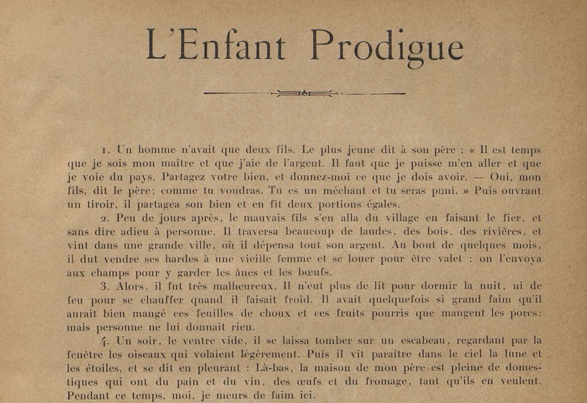
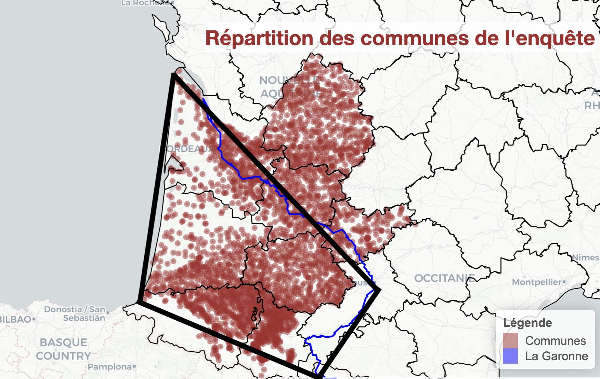

```{r setup, include=FALSE}
knitr::opts_chunk$set(echo = TRUE)
```

```{r include=FALSE}
library(FactoMineR)
library(ggplot2)
library(factoextra)
library(stringdist)
library(proxy)
library(stringi)
library(dplyr)
library(leaflet)
library(plyr)
library(sf)
library(geojsonio)
library(mclust)
library(clue)
library(dendextend)
library(geosphere)
library(nlstools)
```

```{r, include=FALSE}
options(width = 60)
local({
  hook_output <- knitr::knit_hooks$get('output')
  knitr::knit_hooks$set(output = function(x, options) {
    if (!is.null(options$max.height)) options$attr.output <- c(
      options$attr.output,
      sprintf('style="max-height: %s;"', options$max.height)
    )
    hook_output(x, options)
  })
})
```

```{r, include=FALSE}
g_data <- read.csv("bdd_grande.csv", header = TRUE, sep = ";")
departements <- st_read("departements.geojson")
rivers <- st_read("rivers.geojson")
rivers_lines <- rivers[st_geometry_type(rivers) == "LINESTRING" | st_geometry_type(rivers) == "MULTILINESTRING",]
rivers_lines <- st_cast(rivers_lines, "MULTILINESTRING")
```

# Contextualisation {.tabset}

Au sein de ce projet TER d'une durée de Janvier à Mai 2024, nous avons réalisé différentes analyses statistiques concernant l'enquête Bourciez. Cette enquête a été menée par Edouard Bourciez (Professeur à l’Université de Bordeaux) en 1894-1895 et suivie par les Académies de Bordeaux et Toulouse. 

Il s'agit d'une enquête linguistique à grande échelle qui vise à recueillir la traduction de la parabole de "L'enfant prodigue", mot à mot et dans chaque commune par les instituteurs dans l’idiome de la commune où ils enseignent. En effet, 10 départements du sud-ouest de la France, en Nouvelle-Aquitaine, englobant la région historique de la Gascogne, sont concernés et ont répondu à l'enquête. 

Le but étant de distinguer les langues romanes (occitan, français, ...) ainsi que le basque, les différences étymologiques et variations diatopiques de ces idiomes au sein de la région de la Nouvelle-Aquitaine.



En ce qui concerne la géographie, nous trouvons nos données parmis ces territoires :

- La Gascogne, dont le territoire a connu des changements au fil de l’histoire, englobant aujourd’hui des régions françaises telles que la Nouvelle-Aquitaine et l’Occitanie, ainsi qu’une partie de la Catalogne en Espagne. Elle correspond à la zone définie par la Garonne, les Pyérénées et l'océan atlantique. Linguistiquement, elle se caractérise notamment par un consonantisme particulier quand on le compare au reste du domaine occitan (comme nous le verrons dans des exemples). Nous pouvons la caractériser par son triangle gascon, comme sur l'image ci-dessous.

- Une partie du reste du domaine occitan, sur la rive droite de la Garonne. Le domaine occitan couvre le tiers sud de la France (environ 33 départements français, incluant la région Occitanie qui tire son nom de la langue), la Catalogne dans le nord-est de l’Espagne, les vallées occitanes en Italie et Monaco (dont une langue officielle est en fait le génois). L’occitan a été une langue de grande influence culturelle du Xe au début du XXe siècle. L'occitan est une langue romane, partageant de grande similitude avec en premier lieu le catalan, puis les autres langues romanes environnantes telles que le français, l'espagnol ou l'italien. Nous verrons par exemple que le consonantisme gascon (la traitement de certaines consonnes latines) est commun avec une partie du monde ibérique (castillan, basque...).



```{r, include=FALSE}
x_coord <- g_data$x
y_coord <- g_data$y
coords_data <- data.frame(lng = x_coord, lat = y_coord)

m <- leaflet(data = coords_data) %>%
  addTiles() %>%
  addCircleMarkers(
    lng = ~lng,
    lat = ~lat,
    radius = 1,
    color = "brown",
    fillOpacity = 0.5
  ) %>%
  addProviderTiles("CartoDB.Positron") %>%
  addPolygons(data = departements, color = "black", fill = FALSE, weight = 1, opacity = 1) %>%
  addPolylines(data = rivers_lines, color = "blue", weight = 2, opacity = 1) %>%
  addLegend(
    position = "bottomright",
    colors = c("brown", "blue"),
    labels = c("Communes", "La Garonne"),
    title = "Légende"
  ) %>%
  addControl(
    html = '<h3 style="color: brown; font-size: 24px; background: rgba(255, 255, 255, 0.8);">Répartition des communes de l\'enquête</h3>',
    position = "topright",
    className = "map-title"
  )
m
```

# Données {.tabset}

La base de données contient, sur les 5 premières colonnes, des informations sur le département, le canton, la commune et les coordonnées géographiques du mot enregistré. Le reste des colonnes s'agit des 101 mots (1 mot par colonne) recueillis, avec 3 061 origines différentes (1 commune différente par ligne).

```{r}
g_data
```

```{r}
nb_na_tot <- sum(is.na(g_data))

pourcentage_na <- nb_na_tot/(3061*101)*100

col <- g_data[, 6:ncol(g_data)]
nb_na <- sapply(g_data, function(col) sum(is.na(col)))
nb_na_col <- colSums(is.na(col))
moyenne_na <- mean(nb_na_col)

cat("Le nombre total de valeurs manquantes dans le jeu de données est de", nb_na_tot, "données représentant un pourcentage de", pourcentage_na, "% et une moyenne d'environ", moyenne_na, "valeurs manquantes par mots.\n")
```

On trouve un total de 10 021 données manquantes parmi les 309 161 données totales. Cela représente un pourcentage de 3.2% et une moyenne d'environ 99 valeurs manquantes par mots, sans compter les 5 premières colonnes. 
Cela peut s'expliquer par le fait que, soit le mot ne possède pas de traduction dans la commune d'origine, ou bien d'un oubli de la traduction originelle.

Il faut cependant faire la différence entre les données manquantes dûes à un manque d'information réel et entre les absences de forme. En effet, dans le second cas, cela est possible pour le mot "un" qui n'a pas de traduction dans l'idiome de référence tout simplement car ils n'employaient pas ce mot (par exemple en français de nos jours, dans la phrase “je ne suis pas”, le “ne” n’est très souvent pas prononcé).

# Cartographie des caractéristiques linguistiques sur quelques mots {.tabset}

Nous constaterons que pour de nombreux mots sélectionnés pour notre étude, les mots choisis pour traduire tel ou tel terme, les lettres utilisées pour rendre compte de la prononciation de certaines consonnes et de certaines voyelles et même la syntaxe utilisée, dépendent du contexte géographique et historique du lieu de provenance de la traduction. 

Au fil de notre analyse, il se pourrait que nous découvrions un élément qui se démarque de la masse au sein de son cluster d’origine. Cette particularité peut s’expliquer par le fait que certaines personnes, ayant grandi dans un environnement linguistique spécifique, ont par la suite déménagé tout en conservant leur langage d’origine, ce qui a pu influencer leurs réponses à l’enquête. Ainsi, il est possible que certains points du cluster se retrouvent isolés, éloignés du reste de leur groupe d’appartenance.

Ces variations linguistiques offrent un aperçu fascinant de l’évolution linguistique et culturelle entourant les mots choisis, mettant en lumière la richesse et la diversité des influences régionales dans la formation des mots et des expressions.

## 1er mot : "homme"

```{r, include=FALSE}
mot_hommes<- g_data$HOMME_Mot
sort(table(mot_hommes), decreasing = TRUE)
```

### Les mots finissant par "é" en rouge, "e" en orange et "i" en jaune :
```{r}
é <- grep("é$", mot_hommes)
é_x <- g_data$x[é]
é_y <- g_data$y[é]

e <- grep("e$", mot_hommes)
e_x <- g_data$x[e]
e_y <- g_data$y[e]

i <- grep("i$", mot_hommes)
i_x <- g_data$x[i]
i_y <- g_data$y[i]
```

```{r}
lng <- c(é_x)
lat <- c(é_y)
data1 <- data.frame(lng, lat, mot_hommes = mot_hommes[é]) %>%
  mutate(catégorie = 1)

lng <- c(e_x)
lat <- c(e_y)
data2 <- data.frame(lng, lat, mot_hommes = mot_hommes[e]) %>%
  mutate(catégorie = 2)

lng <- c(i_x)
lat <- c(i_y)
data3 <- data.frame(lng, lat, mot_hommes = mot_hommes[i]) %>%
  mutate(catégorie = 3)

combined_data <- rbind(data1, data2, data3)
colors <- c("brown", "orange", "yellow")
pal <- colorFactor(palette = colors, domain = combined_data$catégorie)
type <- c("é", "e", "i")

m <- leaflet(data = combined_data) %>% 
  addTiles() %>%
  addCircleMarkers(
    lng = ~lng, 
    lat = ~lat, 
    radius = 4, 
    color = ~pal(catégorie), 
    fillOpacity = 0.9,
    popup = ~paste("Mot 'homme' finissant par : ", type[catégorie], "<br>Mot complet : ", mot_hommes)
  ) %>%
  addProviderTiles("CartoDB.Positron") %>%
  addPolygons(data = departements, color = "black", fill = FALSE, weight = 1, opacity = 1) %>%
  addPolylines(data = rivers_lines, color = "blue", weight = 2, opacity = 1) %>%
  addLegend(
    position = "bottomright", 
    pal = pal, 
    values = ~catégorie, 
    title = "Mot 'homme' finissant par :",
    labFormat = function(type, cuts, p) { 
      labels = c("é -> homé", "e -> homme", "i -> homi")
      labels[p]
    },
    opacity = 0.7
  ) %>%
  addControl(
    html = '<h3 style="color: brown; font-size: 24px; background: rgba(255, 255, 255, 0.8);">Répartition des communes pour le mot \'homme\'</h3>',
    position = "topright",
    className = "map-title"
  )
m
```

Trois origines étymologiques distinctes captent notre attention concernant la finale masculine singulière du mot “homme”:

- Le groupe “rouge”, composé de mots se terminant par “é”, dont le plus fréquent est “homé”, est transversal aux domaines gascon (sud-est gascon), languedocien et limousin. Le traitement de la finale masculine de ce cluster présente ici une forte similitude avec le mot espagnol “hombre” signifiant “homme”, avec une prononciation finale en “é”.

- Le groupe “orange”, regroupant des mots se terminant par “e”, dont le plus courant est “homme”, correspond assez bien au domaine bordelais. Ce cluster inclut tous les mots qui ressemblent à celui utilisé en français moderne pour “homme”, pouvant indiquer une évolution conjointe des domaines d'oil (français) et bordelais sur ce point [en fait, quand on l'entend, ce n'est pas vraiment un « e » français, c'est un peu entre le e et le a, évolution qu'on retrouve dans d'autres parlers romans d'ailleurs].

- Le groupe “jaune”, constitué de mots se terminant par “i”, dont le plus commun est “homi”, correspond au domaine sud-ouest gascon. On peut l'interpréter comme la fermeture du "é" (un "é" très fermé est assez peu discernable d'un "i"). On peut aussi remarquer qu'en latin on disait "hominem", mais le "i" était bref. En effet, l'évolution naturelle est plutôt hominem>hom(in)em>homen>home comme l'accent était (et est toujours, en français comme en occitan) sur le "o".

En outre, certains mots au sein du même cluster partagent plus ou moins la même orthographe, à l’exception de la première lettre “h”, qui est parfois présente ou absente. Il serait prématuré de tirer des conclusions sur cette variation, car elle pourrait résulter d’omissions lors des réponses à l’enquête.

## 2e mot : "fils"

```{r, include=FALSE}
mot_fils<- g_data$FILS_Mot
sort(table(mot_fils), decreasing = TRUE) 
```

### Les mots commençant par "h" en rouge, "f" en orange et "g" en jaune :
```{r}
h <- grep("^h", mot_fils)
h_x <- g_data$x[h]
h_y <- g_data$y[h]

f <- grep("^f", mot_fils)
f_x <- g_data$x[f]
f_y <- g_data$y[f]

g <- grep("^g", mot_fils)
g_x <- g_data$x[g]
g_y <- g_data$y[g]
```

```{r}
lng <- c(h_x)
lat <- c(h_y)
data1 <- data.frame(lng, lat, mot_fils = mot_fils[h]) %>%
  mutate(catégorie = 1)

lng <- c(f_x)
lat <- c(f_y)
data2 <- data.frame(lng, lat, mot_fils = mot_fils[f]) %>%
  mutate(catégorie = 2)

lng <- c(g_x)
lat <- c(g_y)
data3 <- data.frame(lng, lat, mot_fils = mot_fils[g]) %>%
  mutate(catégorie = 3)

combined_data <- rbind(data1, data2, data3)
colors <- c("brown", "orange", "yellow")
pal <- colorFactor(palette = colors, domain = combined_data$catégorie)
type <- c("h", "f", "g")

m <- leaflet(data = combined_data) %>% 
  addTiles() %>%
  addCircleMarkers(
    lng = ~lng, 
    lat = ~lat, 
    radius = 4, 
    color = ~pal(catégorie), 
    fillOpacity = 0.9,
    popup = ~paste("Mot 'fils' commençant par : ", type[catégorie], "<br>Mot complet : ", mot_fils)
  ) %>%
  addProviderTiles("CartoDB.Positron") %>%
  addPolygons(data = departements, color = "black", fill = FALSE, weight = 1, opacity = 1) %>%
  addPolylines(data = rivers_lines, color = "blue", weight = 2, opacity = 1) %>%
  addLegend(
    position = "bottomright", 
    pal = pal, 
    values = ~catégorie, 
    title = "Mot 'fils' commençant par :",
    labFormat = function(type, cuts, p) { 
      labels = c("h -> hills", "f -> fils", "g -> gouyats")
      labels[p]
    },
    opacity = 0.7
  ) %>%
  addControl(
    html = '<h3 style="color: brown; font-size: 24px; background: rgba(255, 255, 255, 0.8);">Répartition des communes pour le mot \'fils\'</h3>',
    position = "topright",
    className = "map-title"
  )
m
```

Trois origines étymologiques distinctes attirent notre attention concernant le mot "fils":

- Le groupe "rouge", constitué de mots débutant par la lettre "h", dont le plus fréquent est "hills", correspond au domaine sud-ouest gascon. On constate d'ailleurs une nette séparation par la Garonne de ce groupe rouge au sud de la Garonne et les groupes orange et jaunes au nord. Le traitement de l'attaque masculine de ce cluster présente ici une forte similitude avec le mot espagnol “hijo” signifiant “fils”, avec une prononciation en “hi” en début du mot.

- Le groupe "orange", regroupant des mots débutant par la lettre "f", dont le plus commun est "fils", est transversal aux domaines est-gascon et limousin. Ce cluster inclut tous les mots qui ressemblent à celui utilisé en français moderne pour “fils”.

- Le groupe "jaune", composé de mots débutant par la lettre "g", dont le plus courant est "gouyats", correspond assez bien au domaine bordelais. Il trouve son origine dans un territoire qui indique une évolution conjointe des domaines d’oil (français) et bordelais sur ce point. 

Ces distinctions étymologiques offrent un aperçu fascinant de l'histoire linguistique de "fils".

## 3e mot : "donnez"

```{r, include=FALSE}
mot_donnez <- g_data$DONNEZ_Mot
sort(table(mot_donnez), decreasing = TRUE)
```

### Les mots commençant par "do" en rouge, "ba" en orange et "da" en jaune :
```{r}
ba <- grep("^ba", mot_donnez)
ba_x <- g_data$x[ba]
ba_y <- g_data$y[ba]

do <- grep("^do", mot_donnez)
do_x <- g_data$x[do]
do_y <- g_data$y[do]

da <- grep("^da", mot_donnez)
da_x <- g_data$x[da]
da_y <- g_data$y[da]
```

```{r}
lng <- c(do_x)
lat <- c(do_y)
data2 <- data.frame(lng, lat, mot_donnez = mot_donnez[do]) %>%
  mutate(catégorie = 1)

lng <- c(ba_x)
lat <- c(ba_y)
data1 <- data.frame(lng, lat, mot_donnez = mot_donnez[ba]) %>%
  mutate(catégorie = 2)

lng <- c(da_x)
lat <- c(da_y)
data3 <- data.frame(lng, lat, mot_donnez = mot_donnez[da]) %>%
  mutate(catégorie = 3)

combined_data <- rbind(data1, data2, data3)
colors <- c("brown", "orange", "yellow")
pal <- colorFactor(palette = colors, domain = combined_data$catégorie)
type <- c("do", "ba", "da")

m <- leaflet(data = combined_data) %>% 
  addTiles() %>%
  addCircleMarkers(
    lng = ~lng, 
    lat = ~lat, 
    radius = 4, 
    color = ~pal(catégorie), 
    fillOpacity = 0.9,
    popup = ~paste("Mot 'donnez' commençant par : ", type[catégorie], "<br>Mot complet : ", mot_donnez)
  ) %>%
  addProviderTiles("CartoDB.Positron") %>%
  addPolygons(data = departements, color = "black", fill = FALSE, weight = 1, opacity = 1) %>%
  addPolylines(data = rivers_lines, color = "blue", weight = 2, opacity = 1) %>%
  addLegend(
    position = "bottomright", 
    pal = pal, 
    values = ~catégorie, 
    title = "Mot 'donnez' commençant par :",
    labFormat = function(type, cuts, p) { 
      labels = c("do -> donar", "ba -> balhar", "da -> dar")
      labels[p]
    },
    opacity = 0.7
  ) %>%
  addControl(
    html = '<h3 style="color: brown; font-size: 24px; background: rgba(255, 255, 255, 0.8);">Répartition des communes pour le mot \'donnez\'</h3>',
    position = "topright",
    className = "map-title"
  )
m
```

Trois origines étymologiques distinctes attirent notre attention concernant le mot "donnez", avec des variations lexicales :

- Le groupe "rouge", regroupant des mots commençant par "do", dont le plus commun est "douna", est transversal aux domaines est-gascon et limousin. On constate d'ailleurs une nette séparation par la Garonne de ce groupe rouge au nord de la Garonne et les groupes orange et jaunes au sud. Cette similitude lexicaire avec le mot français actuel pour "donnez" se retrouve avec le mot "donar" employé en occitan.

- Le groupe "orange", composé de mots commençant par "ba", dont le plus fréquent est "baillat", trouve son explication dans le territoire de l'ancien occitan, notamment du mot "balhar". Bien que tombées dans l'oubli aujourd'hui, certaines étymologies de cette langue ont persisté dans certaines régions.

- Le groupe "jaune", constitué de mots commençant par "da", dont le plus courant est "dat", trouve son origine dans le territoire sud gascon. Le traitement de ce lexique dans ce cluster présente ici une forte similitude avec le mot espagnol “dar” signifiant “donnez”. De plus, nous pouvons comparer ce lexique par rapport à l’Italie et à la péninsule ibérique, car le verbe "dar" est archaïque et ne s'emploie couramment seulement en gascon.

## 4e mot : "égales"

```{r, include=FALSE}
mot_egales <- g_data$EGALES_Mot
sort(table(mot_egales), decreasing = TRUE)
```

### Les mots finissant par "os" en rouge, "es" en orange et "as" en jaune :
```{r}
os <- grep("os$", mot_egales)
os_x <- g_data$x[os]
os_y <- g_data$y[os]

es <- grep("es$", mot_egales)
es_x <- g_data$x[es]
es_y <- g_data$y[es]

as <- grep("as$", mot_egales)
as_x <- g_data$x[as]
as_y <- g_data$y[as]
```

```{r}
lng <- c(os_x)
lat <- c(os_y)
data1 <- data.frame(lng, lat, mot_egales = mot_egales[os]) %>%
  mutate(catégorie = 1)

lng <- c(es_x)
lat <- c(es_y)
data2 <- data.frame(lng, lat, mot_egales = mot_egales[es]) %>%
  mutate(catégorie = 2)

lng <- c(as_x)
lat <- c(as_y)
data3 <- data.frame(lng, lat, mot_egales = mot_egales[as]) %>%
  mutate(catégorie = 3)

combined_data <- rbind(data1, data2, data3)
colors <- c("brown", "orange", "yellow")
pal <- colorFactor(palette = colors, domain = combined_data$catégorie)
type <- c("os", "es", "as")

m <- leaflet(data = combined_data) %>% 
  addTiles() %>%
  addCircleMarkers(
    lng = ~lng, 
    lat = ~lat, 
    radius = 4, 
    color = ~pal(catégorie), 
    fillOpacity = 0.9,
    popup = ~paste("Mot 'égales' finissant par : ", type[catégorie], "<br>Mot complet : ", mot_egales)
  ) %>%
  addProviderTiles("CartoDB.Positron") %>%
  addPolygons(data = departements, color = "black", fill = FALSE, weight = 1, opacity = 1) %>%
  addPolylines(data = rivers_lines, color = "blue", weight = 2, opacity = 1) %>%
  addLegend(
    position = "bottomright", 
    pal = pal, 
    values = ~catégorie, 
    title = "Mot 'égales' finissant par :",
    labFormat = function(type, cuts, p) { 
      labels = c("os -> égalos", "es -> égales", "as -> égalas")
      labels[p]
    },
    opacity = 0.7
  ) %>%
  addControl(
    html = '<h3 style="color: brown; font-size: 24px; background: rgba(255, 255, 255, 0.8);">Répartition des communes pour le mot \'égales\'</h3>',
    position = "topright",
    className = "map-title"
  )
m
```

Trois origines étymologiques distinctes captent notre attention concernant la finale féminine pluriel du mot "égales":

- Le groupe "rouge", composé de mots se terminant par "os", dont le plus fréquent est "égalos", est transversal aux domaines gascon (sud-est gascon) et languedocien. Bien que ces racines soient aujourd'hui oubliées, elles peuvent persister dans certaines régions.

- Le groupe "orange", regroupant des mots se terminant par "es", dont le plus courant est "égales", correspond assez bien au domaine bordelais et sud-ouest gascon. Ce cluster inclut tous les mots qui ressemblent à celui utilisé en français moderne pour “égales”, pouvant indiquer une évolution française et bordelaise sur ce terme moderne.

- Le groupe "jaune", constitué de mots se terminant par "as", dont le plus courant est "égalas", correspond au domaine sud gascon pour le groupe au sud, et limousin pour le groupe au nord. Cette étymologie présente des similitudes notables avec le pluriel féminin des mots espagnols.

## 5e mot : "village"

### Avec les accents :
```{r, include=FALSE}
mot_village <- g_data$VILLAGE_Mot
sort(table(mot_village), decreasing = TRUE)
```

#### Les mots finissant par "yé" en rouge, "gé" en orange, "jé" en jaune et "zé" en rose :
```{r}
yé <- grep("yé$", mot_village)
yé_x <- g_data$x[yé]
yé_y <- g_data$y[yé]

gé <- grep("gé$", mot_village)
gé_x <- g_data$x[gé]
gé_y <- g_data$y[gé]

jé <- grep("jé$", mot_village)
jé_x <- g_data$x[jé]
jé_y <- g_data$y[jé]

zé <- grep("zé$", mot_village)
zé_x <- g_data$x[zé]
zé_y <- g_data$y[zé]
```

```{r}
lng <- c(yé_x)
lat <- c(yé_y)
data1 <- data.frame(lng, lat, mot_village = mot_village[yé]) %>%
  mutate(catégorie = 1)

lng <- c(gé_x)
lat <- c(gé_y)
data2 <- data.frame(lng, lat, mot_village = mot_village[gé]) %>%
  mutate(catégorie = 2)

lng <- c(jé_x)
lat <- c(jé_y)
data3 <- data.frame(lng, lat, mot_village = mot_village[jé]) %>%
  mutate(catégorie = 3)

lng <- c(zé_x)
lat <- c(zé_y)
data4 <- data.frame(lng, lat, mot_village = mot_village[zé]) %>%
  mutate(catégorie = 4)

combined_data <- rbind(data1, data2, data3, data4)
colors <- c("brown", "orange", "yellow", "pink")
pal <- colorFactor(palette = colors, domain = combined_data$catégorie)
type <- c("yé", "gé", "jé", "zé")

m <- leaflet(data = combined_data) %>% 
  addTiles() %>%
  addCircleMarkers(
    lng = ~lng, 
    lat = ~lat, 
    radius = 4, 
    color = ~pal(catégorie), 
    fillOpacity = 0.9,
    popup = ~paste("Mot 'village' finissant par : ", type[catégorie], "<br>Mot complet : ", mot_village)
  ) %>%
  addProviderTiles("CartoDB.Positron") %>%
  addPolygons(data = departements, color = "black", fill = FALSE, weight = 1, opacity = 1) %>%
  addPolylines(data = rivers_lines, color = "blue", weight = 2, opacity = 1) %>%
  addLegend(
    position = "bottomright", 
    pal = pal, 
    values = ~catégorie, 
    title = "Mot 'village' finissant par :",
    labFormat = function(type, cuts, p) { 
      labels = c("yé -> bilatyé", "gé -> bilatgé", "jé -> bilatjé", "zé -> bilatzé")
      labels[p]
    },
    opacity = 0.7
  ) %>%
  addControl(
    html = '<h3 style="color: brown; font-size: 24px; background: rgba(255, 255, 255, 0.8);">Répartition des communes pour le mot \'village\'</h3>',
    position = "topright",
    className = "map-title"
  )
m
```

On remarque que ces dernières lettres sont utilisées dans plus ou moins chaque endroit de la région, on choisit donc une autre approche sans les accents.

### Sans les accents :
```{r, include=FALSE}
sans_accent <- stri_trans_general(mot_village, "Latin-ASCII")
sort(table(sans_accent), decreasing = TRUE)
```

#### Les mots finissant par "ye" en rouge, "ge" en orange, "je" en jaune et "ze" en rose :
```{r}
ye <- grep("ye$", sans_accent)
ye_x <- g_data$x[ye]
ye_y <- g_data$y[ye]

ge <- grep("ge$", sans_accent)
ge_x <- g_data$x[ge]
ge_y <- g_data$y[ge]

je <- grep("je$", sans_accent)
je_x <- g_data$x[je]
je_y <- g_data$y[je]

ze <- grep("ze$", sans_accent)
ze_x <- g_data$x[ze]
ze_y <- g_data$y[ze]
```

```{r}
lng <- c(ye_x)
lat <- c(ye_y)
data1 <- data.frame(lng, lat, sans_accent = sans_accent[ye]) %>%
  mutate(catégorie = 1)

lng <- c(ge_x)
lat <- c(ge_y)
data2 <- data.frame(lng, lat, sans_accent = sans_accent[ge]) %>%
  mutate(catégorie = 2)

lng <- c(je_x)
lat <- c(je_y)
data3 <- data.frame(lng, lat, sans_accent = sans_accent[je]) %>%
  mutate(catégorie = 3)

lng <- c(ze_x)
lat <- c(ze_y)
data4 <- data.frame(lng, lat, sans_accent = sans_accent[ze]) %>%
  mutate(catégorie = 4)

combined_data <- rbind(data1, data2, data3, data4)
colors <- c("brown", "orange", "yellow", "pink")
pal <- colorFactor(palette = colors, domain = combined_data$catégorie)
type <- c("ye", "ge", "je", "ze")

m <- leaflet(data = combined_data) %>% 
  addTiles() %>%
  addCircleMarkers(
    lng = ~lng, 
    lat = ~lat, 
    radius = 4, 
    color = ~pal(catégorie), 
    fillOpacity = 0.9,
    popup = ~paste("Mot 'village' finissant par : ", type[catégorie], "<br>Mot complet : ", sans_accent)
  ) %>%
  addProviderTiles("CartoDB.Positron") %>%
  addPolygons(data = departements, color = "black", fill = FALSE, weight = 1, opacity = 1) %>%
  addPolylines(data = rivers_lines, color = "blue", weight = 2, opacity = 1) %>%
  addLegend(
    position = "bottomright", 
    pal = pal, 
    values = ~catégorie, 
    title = "Mot 'village' finissant par :",
    labFormat = function(type, cuts, p) { 
      labels = c("ye -> bilatye", "ge -> bilatge", "je -> bilatje", "ze -> bilatze")
      labels[p]
    },
    opacity = 0.7
  ) %>%
  addControl(
    html = '<h3 style="color: brown; font-size: 24px; background: rgba(255, 255, 255, 0.8);">Répartition des communes pour le mot \'village\'</h3>',
    position = "topright",
    className = "map-title"
  )
m
```

On remarque que cette carte est un peu plus pertinente que la précédente, mais nous décidons de fusionner "je" et "ge" ensemble.

#### Les mots finissant par "ye" en rouge, "ge" ou "je" en orange et "ze" en jaune :
```{r}
ye <- grep("ye$", sans_accent)
ye_x <- g_data$x[ye]
ye_y <- g_data$y[ye]

ge_je <- grep("ge$|je$", sans_accent)
ge_je_x <- g_data$x[ge_je]
ge_je_y <- g_data$y[ge_je]

ze <- grep("ze$", sans_accent)
ze_x <- g_data$x[ze]
ze_y <- g_data$y[ze]
```

```{r}
lng <- c(ye_x)
lat <- c(ye_y)
data1 <- data.frame(lng, lat, sans_accent = sans_accent[ye]) %>%
  mutate(catégorie = 1)

lng <- c(ge_je_x)
lat <- c(ge_je_y)
data2 <- data.frame(lng, lat, sans_accent = sans_accent[ge_je]) %>%
  mutate(catégorie = 2)

lng <- c(ze_x)
lat <- c(ze_y)
data3 <- data.frame(lng, lat, sans_accent = sans_accent[ze]) %>%
  mutate(catégorie = 3)

combined_data <- rbind(data1, data2, data3)
colors <- c("brown", "orange", "yellow")
pal <- colorFactor(palette = colors, domain = combined_data$catégorie)
type <- c("ye", "ge_je", "ze")

m <- leaflet(data = combined_data) %>% 
  addTiles() %>%
  addCircleMarkers(
    lng = ~lng, 
    lat = ~lat, 
    radius = 4, 
    color = ~pal(catégorie), 
    fillOpacity = 0.9,
    popup = ~paste("Mot 'village' finissant par : ", type[catégorie], "<br>Mot complet : ", sans_accent)
  ) %>%
  addProviderTiles("CartoDB.Positron") %>%
  addPolygons(data = departements, color = "black", fill = FALSE, weight = 1, opacity = 1) %>%
  addPolylines(data = rivers_lines, color = "blue", weight = 2, opacity = 1) %>%
  addLegend(
    position = "bottomright", 
    pal = pal, 
    values = ~catégorie, 
    title = "Mot 'village' finissant par :",
    labFormat = function(type, cuts, p) { 
      labels = c("ye -> bilatye", "ge_je -> bilatge/bilatje", "ze -> bilatze")
      labels[p]
    },
    opacity = 0.7
  ) %>%
  addControl(
    html = '<h3 style="color: brown; font-size: 24px; background: rgba(255, 255, 255, 0.8);">Répartition des communes pour le mot \'village\'</h3>',
    position = "topright",
    className = "map-title"
  )
m
```

L'analyse de la finale du mot "village" se révèle être plus complexe que celles précédemment abordées. Ici, il est difficile de tirer une conclusion définitive, car nous sommes confrontés à une variété de prononciations distinctes. La consonne divergente dans chacun de nos clusters reflète en réalité la diversité de la prononciation selon chaque individu : [ge/je], [ze] ou [ye] ? En effet, la manière dont le mot est prononcé joue un rôle essentiel, une nuance qui ne peut être pleinement saisie par son orthographe seule.

Pour approfondir notre analyse, nous pourrions envisager des enquêtes ou des études phonétiques pour mieux comprendre les variations de prononciation selon les régions géographiques ou les groupes sociaux. De plus, les contextes historiques et culturels pourraient également fournir des éclaircissements sur ces différentes façons de prononcer le mot "village".

## 6e section de mots qui commence par v ou b : village, ville, vendre, vieille, valet

### Mot "village"
```{r, include=FALSE}
mot_village <- g_data$VILLAGE_Mot
sort(table(mot_village), decreasing = TRUE)
```

```{r}
v <- grep("^v", mot_village)
v_x <- g_data$x[v]
v_y <- g_data$y[v]

b <- grep("^b", mot_village)
b_x <- g_data$x[b]
b_y <- g_data$y[b]
```

```{r}
lng <- c(v_x)
lat <- c(v_y)
data1 <- data.frame(lng, lat, mot_village = mot_village[v]) %>%
  mutate(catégorie = 1)

lng <- c(b_x)
lat <- c(b_y)
data2 <- data.frame(lng, lat, mot_village = mot_village[b]) %>%
  mutate(catégorie = 2)

combined_data <- rbind(data1, data2)
colors <- c("orange", "brown")
pal <- colorFactor(palette = colors, domain = combined_data$catégorie)
type <- c("v", "b")

m <- leaflet(data = combined_data) %>% 
  addTiles() %>%
  addCircleMarkers(
    lng = ~lng, 
    lat = ~lat, 
    radius = 4, 
    color = ~pal(catégorie), 
    fillOpacity = 0.9,
    popup = ~paste("Mot 'village' commençant par : ", type[catégorie], "<br>Mot complet : ", mot_village)
  ) %>%
  addProviderTiles("CartoDB.Positron") %>%
  addPolygons(data = departements, color = "black", fill = FALSE, weight = 1, opacity = 1) %>%
  addPolylines(data = rivers_lines, color = "blue", weight = 2, opacity = 1) %>%
  addLegend(
    position = "bottomright", 
    pal = pal, 
    values = ~catégorie, 
    title = "Mot 'village' commençant par :",
    labFormat = function(type, cuts, p) { 
      labels = c("v -> villagé", "b -> bilatyé")
      labels[p]
    },
    opacity = 0.7
  ) %>%
  addControl(
    html = '<h3 style="color: brown; font-size: 24px; background: rgba(255, 255, 255, 0.8);">Répartition des communes pour le mot \'village\'</h3>',
    position = "topright",
    className = "map-title"
  )
m
```

### Mot "ville"
```{r, include=FALSE}
mot_ville <- g_data$VILLE_Mot
sort(table(mot_ville), decreasing = TRUE)
```

```{r}
v <- grep("^v", mot_ville)
v_x <- g_data$x[v]
v_y <- g_data$y[v]

b <- grep("^b", mot_ville)
b_x <- g_data$x[b]
b_y <- g_data$y[b]
```

```{r}
lng <- c(v_x)
lat <- c(v_y)
data1 <- data.frame(lng, lat, mot_ville = mot_ville[v]) %>%
  mutate(catégorie = 1)

lng <- c(b_x)
lat <- c(b_y)
data2 <- data.frame(lng, lat, mot_ville = mot_ville[b]) %>%
  mutate(catégorie = 2)

combined_data <- rbind(data1, data2)
colors <- c("orange", "brown")
pal <- colorFactor(palette = colors, domain = combined_data$catégorie)
type <- c("v", "b")

m <- leaflet(data = combined_data) %>% 
  addTiles() %>%
  addCircleMarkers(
    lng = ~lng, 
    lat = ~lat, 
    radius = 4, 
    color = ~pal(catégorie), 
    fillOpacity = 0.9,
    popup = ~paste("Mot 'ville' commençant par : ", type[catégorie], "<br>Mot complet : ", mot_ville)
  ) %>%
  addProviderTiles("CartoDB.Positron") %>%
  addPolygons(data = departements, color = "black", fill = FALSE, weight = 1, opacity = 1) %>%
  addPolylines(data = rivers_lines, color = "blue", weight = 2, opacity = 1) %>%
  addLegend(
    position = "bottomright", 
    pal = pal, 
    values = ~catégorie, 
    title = "Mot 'ville' commençant par :",
    labFormat = function(type, cuts, p) { 
      labels = c("v -> villo", "b -> bilo")
      labels[p]
    },
    opacity = 0.7
  ) %>%
  addControl(
    html = '<h3 style="color: brown; font-size: 24px; background: rgba(255, 255, 255, 0.8);">Répartition des communes pour le mot \'ville\'</h3>',
    position = "topright",
    className = "map-title"
  )
m
```

### Mot "vendre"
```{r, include=FALSE}
mot_vendre <- g_data$VENDRE_Mot
sort(table(mot_vendre), decreasing = TRUE)
```

```{r}
v <- grep("^v", mot_vendre)
v_x <- g_data$x[v]
v_y <- g_data$y[v]

b <- grep("^b", mot_vendre)
b_x <- g_data$x[b]
b_y <- g_data$y[b]
```

```{r}
lng <- c(v_x)
lat <- c(v_y)
data1 <- data.frame(lng, lat, mot_vendre = mot_vendre[v]) %>%
  mutate(catégorie = 1)

lng <- c(b_x)
lat <- c(b_y)
data2 <- data.frame(lng, lat, mot_vendre = mot_vendre[b]) %>%
  mutate(catégorie = 2)

combined_data <- rbind(data1, data2)
colors <- c("orange", "brown")
pal <- colorFactor(palette = colors, domain = combined_data$catégorie)
type <- c("v", "b")

m <- leaflet(data = combined_data) %>% 
  addTiles() %>%
  addCircleMarkers(
    lng = ~lng, 
    lat = ~lat, 
    radius = 4, 
    color = ~pal(catégorie), 
    fillOpacity = 0.9,
    popup = ~paste("Mot 'vendre' commençant par : ", type[catégorie], "<br>Mot complet : ", mot_vendre)
  ) %>%
  addProviderTiles("CartoDB.Positron") %>%
  addPolygons(data = departements, color = "black", fill = FALSE, weight = 1, opacity = 1) %>%
  addPolylines(data = rivers_lines, color = "blue", weight = 2, opacity = 1) %>%
  addLegend(
    position = "bottomright", 
    pal = pal, 
    values = ~catégorie, 
    title = "Mot 'vendre' commençant par :",
    labFormat = function(type, cuts, p) { 
      labels = c("v -> vendré", "b -> béné")
      labels[p]
    },
    opacity = 0.7
  ) %>%
  addControl(
    html = '<h3 style="color: brown; font-size: 24px; background: rgba(255, 255, 255, 0.8);">Répartition des communes pour le mot \'vendre\'</h3>',
    position = "topright",
    className = "map-title"
  )
m
```

### Mot "vieille"
```{r, include=FALSE}
mot_vieille <- g_data$VIEILLE_Mot
sort(table(mot_vieille), decreasing = TRUE)
```

```{r}
v <- grep("^v", mot_vieille)
v_x <- g_data$x[v]
v_y <- g_data$y[v]

b <- grep("^b", mot_vieille)
b_x <- g_data$x[b]
b_y <- g_data$y[b]
```

```{r}
lng <- c(v_x)
lat <- c(v_y)
data1 <- data.frame(lng, lat, mot_vieille = mot_vieille[v]) %>%
  mutate(catégorie = 1)

lng <- c(b_x)
lat <- c(b_y)
data2 <- data.frame(lng, lat, mot_vieille = mot_vieille[b]) %>%
  mutate(catégorie = 2)

combined_data <- rbind(data1, data2)
colors <- c("orange", "brown")
pal <- colorFactor(palette = colors, domain = combined_data$catégorie)
type <- c("v", "b")

m <- leaflet(data = combined_data) %>% 
  addTiles() %>%
  addCircleMarkers(
    lng = ~lng, 
    lat = ~lat, 
    radius = 4, 
    color = ~pal(catégorie), 
    fillOpacity = 0.9,
    popup = ~paste("Mot 'vieille' commençant par : ", type[catégorie], "<br>Mot complet : ", mot_vieille)
  ) %>%
  addProviderTiles("CartoDB.Positron") %>%
  addPolygons(data = departements, color = "black", fill = FALSE, weight = 1, opacity = 1) %>%
  addPolylines(data = rivers_lines, color = "blue", weight = 2, opacity = 1) %>%
  addLegend(
    position = "bottomright", 
    pal = pal, 
    values = ~catégorie, 
    title = "Mot 'vieille' commençant par :",
    labFormat = function(type, cuts, p) { 
      labels = c("v -> vieillo", "b -> bieillo")
      labels[p]
    },
    opacity = 0.7
  ) %>%
  addControl(
    html = '<h3 style="color: brown; font-size: 24px; background: rgba(255, 255, 255, 0.8);">Répartition des communes pour le mot \'vieille\'</h3>',
    position = "topright",
    className = "map-title"
  )
m
```

### Mot "valet"
```{r, include=FALSE}
mot_valet <- g_data$VALET_Mot
sort(table(mot_valet), decreasing = TRUE)
```

```{r}
v <- grep("^v", mot_valet)
v_x <- g_data$x[v]
v_y <- g_data$y[v]

b <- grep("^b", mot_valet)
b_x <- g_data$x[b]
b_y <- g_data$y[b]
```

```{r}
lng <- c(v_x)
lat <- c(v_y)
data1 <- data.frame(lng, lat, mot_valet = mot_valet[v]) %>%
  mutate(catégorie = 1)

lng <- c(b_x)
lat <- c(b_y)
data2 <- data.frame(lng, lat, mot_valet = mot_valet[b]) %>%
  mutate(catégorie = 2)

combined_data <- rbind(data1, data2)
colors <- c("orange", "brown")
pal <- colorFactor(palette = colors, domain = combined_data$catégorie)
type <- c("v", "b")

m <- leaflet(data = combined_data) %>% 
  addTiles() %>%
  addCircleMarkers(
    lng = ~lng, 
    lat = ~lat, 
    radius = 4, 
    color = ~pal(catégorie), 
    fillOpacity = 0.9,
    popup = ~paste("Mot 'valet' commençant par : ", type[catégorie], "<br>Mot complet : ", mot_valet)
  ) %>%
  addProviderTiles("CartoDB.Positron") %>%
  addPolygons(data = departements, color = "black", fill = FALSE, weight = 1, opacity = 1) %>%
  addPolylines(data = rivers_lines, color = "blue", weight = 2, opacity = 1) %>%
  addLegend(
    position = "bottomright", 
    pal = pal, 
    values = ~catégorie, 
    title = "Mot 'valet' commençant par :",
    labFormat = function(type, cuts, p) { 
      labels = c("v -> valé", "b -> baylét")
      labels[p]
    },
    opacity = 0.7
  ) %>%
  addControl(
    html = '<h3 style="color: brown; font-size: 24px; background: rgba(255, 255, 255, 0.8);">Répartition des communes pour le mot \'valet\'</h3>',
    position = "topright",
    className = "map-title"
  )
m
```

On constate que pour chacun de ces g_data qui partagent aujourd'hui la même première lettre "v", leur répartition selon la première lettre de leur consonne en attaque est également homogène. En effet, la lettre "v" était prédominante dans le nord de la région, tandis que la lettre "b" était plus fréquemment utilisée dans le sud. Cette constatation met en lumière une cohérence avec les pratiques orthographiques actuelles.

En examinant de plus près ces deux groupes de clusters présentant des prononciations distinctes, nous observons :

- Le groupe "orange", constitué de mots débutant par "v", est transversal aux domaines nord gascon et limousin. Ce cluster inclut tous les mots qui ont la même consonne en attaque que celle utilisée en français moderne. Cette similitude avec les mots français actuels commençant également par "v" souligne la perpétuation de la culture occitane dans certains termes contemporains.

- Le groupe "rouge", regroupant des mots commençant par "b", correspond au domaine sud gascon. Le traitement de la consonne en attaque de ce cluster présente ici une forte similitude avec les mots espagnols commençant par "v" mais prononcés "b", renforçant ainsi notre explication.

# Clustering

Par la suite, nous nous sommes intéressées à la question suivante : existe-t-il une structure de cohérence des données, sans se placer au niveau du plus petit dénominateur commun (c'est à dire au niveau d'une seule caractéristique) ? Et c'est ici que les techniques de clusturing entrent en jeu. En prenant le texte dans son ensemble, et non mot à mot, nous allons pouvoir trouver différentes structures de cohérance sur lesquelles les linguistes pourront se baser.

# KNN {.tabset}

Nous souhaitons obtenir des clusters en utilisant la méthode KNN (Méthode des K plus proches voisins) sur l'ensemble des données disponibles. Comme les variables que nous souhaitons utiliser pour le KNN sont toutes des variables qualitatives (elles stockent différentes traductions pour chaque mot), nous devrons tout d'abord utiliser l'ACM (Analyse des Correspondances Multiples). L'ACM est une méthode statistique conçue spécifiquement pour analyser des données catégorielles ou qualitatives. Elle permet d'explorer les relations entre les modalités de différentes variables catégorielles dans un ensemble de données, et de déterminer des distances de similarité ou de dissimilarité entre les modalités. Dans notre cas, l'ACM permet d'analyser la similarité et la dissimilarité entre chaque mot disponible dans chaque colonne et d'observer si les mots se rassemblent, tout en prenant en compte toutes les variables disponibles pour chaque donnée.

Une fois que les données ont été analysées pour comprendre les relations entre les variables à l'aide de l'ACM, nous pouvons utiliser l'algorithme kNN pour effectuer la classification. L'algorithme kNN est une méthode de classification supervisée utilisée pour attribuer une classe à un nouvel échantillon en se basant sur les classes des échantillons voisins dans l'espace des caractéristiques et donc sur les distances entre chaque donnée obtenue grâce à l'ACM.

Nous allons procéder à créer des clusters à l'aide de la méthode KNN en prenant en compte les accents et en le comparant avec la partition lorsque nous ne prenons pas en compte les accents dans l'écriture de chaque mot.

```{r}
#couleurs cartes
my_col_4 <- c("#F15025", "#F1D525", "#C70039", "#682E0B")
my_col_5 <- c("#F15025", "#F1D525", "#F4D2E2", "#C70039", "#682E0B")
my_col_7 <- c("#F15025", "#F1D525", "#F4D2E2", "#C70039", "#682E0B", "#8FD175", "#75b8d1")
```

## Avec les accents {.tabset}

Nous allons créer des clusters avec la méthode KNN en prenant en compte les accès dans l’écriture des mots. Dans un première temps nous allons procéder par l'ACM. 

```{r}
if (!file.exists("acm_with_act.RData")) {
  variables_qualitatives <- subset(g_data, select = -c(département, commune, canton, x, y))
  acm_with_act <- MCA(variables_qualitatives, graph = FALSE)
  save(acm_with_act, file = "acm_with_act.RData")
}
```

Ensuite pour décider du nombre de k clusters optimal pour la méthode KNN, nous pouvons regarder le graphique associé à la méthode du coude.

La méthode du "coude" consiste à trouver le nombre optimal de clusters en traçant un graphique qui représente la variance intra-cluster en fonction du nombre de clusters. On observe ensuite le point où l'ajout de clusters supplémentaires ne diminue pas significativement la variance intra-cluster, ce qui est le "coude" du graphique. Ce point indique le nombre optimal de clusters à utiliser pour regrouper les données de manière efficace.

```{r}
load("acm_with_act.RData")
pc_coords <- as.data.frame(acm_with_act$ind$coord)

elbow_with_act <- fviz_nbclust(pc_coords, kmeans, method = "wss")
plot(elbow_with_act)
```

Sur ce graphique, nous constatons que le nombre optimal de clusters est 5, 7 et 9. Nous allons nous focaliser uniquement sur les méthodes avec 5 et 7 clusters, car 9 semble être  nombre excessifs de clusters pour notre analyse. De plus, nous allons également effectuer une analyse avec 4 clusters afin de pouvoir comparer par la suite la méthode KNN avec 4 clusters à celle de CAH (Classification ascendante hiérarchique) que nous allons effectuer ultérieurement dans la partie suivante.

### 4 Clusters

```{r}
k = 4
clusters <- kmeans(acm_with_act$ind$coord, centers = k)
g_data$cluster <- clusters$cluster

palette_couleurs <- function(cluster) {
  couleurs <- my_col_4
  return(couleurs[cluster])
}

clusters_uniques_triés <- sort(unique(g_data$cluster))

leaflet() %>%
  addProviderTiles("CartoDB.Positron") %>%
  addCircleMarkers(data = g_data, ~x, ~y, color = ~palette_couleurs(cluster), 
                   radius = 2, opacity = 1, popup = paste("Commune:", g_data$commune, "<br/>",
                                                          "Canton:", g_data$canton, "<br/>",
                                                          "Département:", g_data$département, "<br/>",
                                                          "Cluster:", g_data$cluster)) %>%
  addLegend(position = "bottomright", colors = my_col_4,
            labels = as.character(clusters_uniques_triés), title = "Cluster") %>%
  addPolygons(data = departements, color = "black", fill = FALSE, weight = 1, opacity = 1) %>%
  addPolylines(data = rivers_lines, color = "blue", weight = 2, opacity = 1)

```

Taille de chaque cluster :

```{r}
table(clusters$cluster)
```

Les deux modalités avec le plus grand nombre d'occurrences pour chaque variable et cluster :

```{r}
resultats <- data.frame(Cluster = numeric(),
                        Mot_1 = character(),
                        Nom_Colonne_Mot_1 = character(),
                        Occurrences_Mot_1 = numeric(),
                        Mot_2 = character(),
                        Nom_Colonne_Mot_2 = character(),
                        Occurrences_Mot_2 = numeric(),
                        stringsAsFactors = FALSE,
                        row.names = NULL)
colonnes <- setdiff(names(g_data), c("département", "commune", "canton", "x", "y"))

for (colonne in colonnes) {
  for (cluster in unique(g_data$cluster)) {
    subset_data <- g_data[g_data$cluster == cluster, ]
    modalites <- table(subset_data[[colonne]])
    
    if (length(modalites) >= 2) {
      sorted_modalites <- sort(modalites, decreasing = TRUE)
      top_mot_1 <- names(sorted_modalites)[1]
      top_occurrences_1 <- sorted_modalites[1]
      top_mot_2 <- names(sorted_modalites)[2]
      top_occurrences_2 <- sorted_modalites[2]

      resultats <- rbind(resultats, data.frame(Cluster = cluster,
                                               Mot_1 = top_mot_1,
                                               Nom_Colonne_Mot_1 = colonne,
                                               Occurrences_Mot_1 = top_occurrences_1,
                                               Mot_2 = top_mot_2,
                                               Nom_Colonne_Mot_2 = colonne,
                                               Occurrences_Mot_2 = top_occurrences_2,
                                               row.names = NULL))
    }
  }
}
resultats
```

### 5 Clusters

```{r}
k = 5
clusters_act_5 <- kmeans(acm_with_act$ind$coord, centers = k)
g_data$cluster <- clusters_act_5$cluster

palette_couleurs <- function(cluster) {
  couleurs <- my_col_5
  return(couleurs[cluster])
}

clusters_vecteur <- clusters_act_5$cluster
clusters_uniques_triés <- sort(unique(g_data$cluster))

leaflet() %>%
  addProviderTiles("CartoDB.Positron") %>%
  addCircleMarkers(data = g_data, ~x, ~y, color = ~palette_couleurs(clusters_vecteur), 
                   radius = 2, opacity = 1, popup = paste("Commune:", g_data$commune, "<br/>",
                                                          "Canton:", g_data$canton, "<br/>",
                                                          "Département:", g_data$département, "<br/>",
                                                          "Cluster:", g_data$cluster)) %>%
  addLegend(position = "bottomright", colors = my_col_5,
            labels = as.character(clusters_uniques_triés), title = "Cluster") %>%
  addPolygons(data = departements, color = "black", fill = FALSE, weight = 1, opacity = 1) %>%
  addPolylines(data = rivers_lines, color = "blue", weight = 2, opacity = 1)

```

Taille de chaque cluster :

```{r}
table(clusters_act_5$cluster)
```

Nous constatons que le cluster numéro 5 est formé de seulement 4 communes. Nous allons analyser dans la prochaine partie la formation de chaque cluster afin de comprendre pourquoi ce cluster contient un nombre très restreint de communes.

Les deux modalités avec le plus grand nombre d'occurrences pour chaque variable et cluster :

```{r}
resultats <- data.frame(Cluster = numeric(),
                        Mot_1 = character(),
                        Nom_Colonne_Mot_1 = character(),
                        Occurrences_Mot_1 = numeric(),
                        Mot_2 = character(),
                        Nom_Colonne_Mot_2 = character(),
                        Occurrences_Mot_2 = numeric(),
                        stringsAsFactors = FALSE,
                        row.names = NULL)
colonnes <- setdiff(names(g_data), c("département", "commune", "canton", "x", "y"))

for (colonne in colonnes) {
  for (cluster in unique(g_data$cluster)) {
    subset_data <- g_data[g_data$cluster == cluster, ]
    modalites <- table(subset_data[[colonne]])
    
    if (length(modalites) >= 2) {
      sorted_modalites <- sort(modalites, decreasing = TRUE)
      top_mot_1 <- names(sorted_modalites)[1]
      top_occurrences_1 <- sorted_modalites[1]
      top_mot_2 <- names(sorted_modalites)[2]
      top_occurrences_2 <- sorted_modalites[2]

      resultats <- rbind(resultats, data.frame(Cluster = cluster,
                                               Mot_1 = top_mot_1,
                                               Nom_Colonne_Mot_1 = colonne,
                                               Occurrences_Mot_1 = top_occurrences_1,
                                               Mot_2 = top_mot_2,
                                               Nom_Colonne_Mot_2 = colonne,
                                               Occurrences_Mot_2 = top_occurrences_2,
                                               row.names = NULL))
    }
  }
}

resultats
```

### 7 Clusters

```{r}
k = 7
clusters <- kmeans(acm_with_act$ind$coord, centers = k)
g_data$cluster <- clusters$cluster

palette_couleurs <- function(cluster) {
  couleurs <- my_col_7
  return(couleurs[cluster])
}

clusters_uniques_triés <- sort(unique(g_data$cluster))

leaflet() %>%
  addProviderTiles("CartoDB.Positron") %>%
  addCircleMarkers(data = g_data, ~x, ~y, color = ~palette_couleurs(cluster), 
                   radius = 2, opacity = 1, popup = paste("Commune:", g_data$commune, "<br/>",
                                                          "Canton:", g_data$canton, "<br/>",
                                                          "Département:", g_data$département, "<br/>",
                                                          "Cluster:", g_data$cluster)) %>%
  addLegend(position = "bottomright", colors = my_col_7,
            labels = as.character(clusters_uniques_triés), title = "Cluster") %>%
  addPolygons(data = departements, color = "black", fill = FALSE, weight = 1, opacity = 1) %>%
  addPolylines(data = rivers_lines, color = "blue", weight = 2, opacity = 1)
```

Taille de chaque cluster :

```{r}
table(clusters$cluster)
```

Nous nous intéressons à savoir pourquoi le cluster numéro 3 et le cluster numéro 5 contiennent respectivement 3 et une seule commune.

Nous commençons par le cluster 3. Nous avons regroupé les données de ce cluster dans un dataframe.

```{r}
cluster_3_data <- subset(g_data,  cluster == 3, select = -c(cluster))
commune <- cluster_3_data$commune
cluster_3_data
```

À première vue, il semble que les traductions des mots pour ces trois communes soient très similaires. Cette observation suggère que les habitants de ces régions partagent potentiellement un vocabulaire commun ou des particularités linguistiques similaires.

Dans la partie suivante de notre analyse, nous allons plonger plus en profondeur pour comprendre pourquoi ces clusters ont été formés. Nous allons examiner les caractéristiques linguistiques spécifiques, (telles que les préfixes, les suffixes, etc), qui peuvent avoir contribué à la formation de ces groupes de communes.

Nous observerons que le cluster numéro 2 contient qu'un seul élément et nous souhaitons étudier pourquoi cette commune se retrouve seule. Pour ce faire, nous allons voir si les traductions de chaque mot pour cette commune sont uniques par rapport à toutes les autres communes disponibles dans notre étude.

Nous allons maintenant nous intéresser à la raison pour laquelle le cluster 5 ne contient qu'une seule commune. Nous pourrions examiner si cette commune possède des traductions qui ne se retrouvent pas dans les autres communes, ce qui pourrait expliquer pourquoi elle est séparée des autres dans un cluster distinct.

Les données pour la commune Moulis-en-Médoc sans les accens :

```{r}
cluster_5_data <- subset(g_data,  cluster == 5, select = -c(cluster))
cluster_5_data
```

On va vérifier si les traductions sont uniques par rapport à toutes les autres traductions disponibles pour chaque mot dans toutes les autres communes.

```{r}
verifier_presence_colonne <- function(colonne_donnees) {
  colonne_donnees[is.na(colonne_donnees)] <- ""
  presence <- colonne_donnees %in% mots[[colonne_donnees]]
  return(presence)
}
```

```{r}
cluster_5_data <- subset(cluster_5_data, select = -c(département, canton, commune))
resultats <- lapply(colnames(cluster_5_data_act), function(col) {
  verifier_presence_colonne(cluster_5_data[[col]])
})

res_5 <- as.data.frame(resultats)
colnames(res_5) <- colnames(cluster_5_data)
res_5
```

Le pourcentage de valeurs traductions uniques pour la commune Moulis-en-Médoc en ne prenant pas compte les accents est de :

```{r}
nb_false <- sum(!unlist(res_5))
cat((nb_false / length(cluster_5_data)) * 100, "%\n")
```

Nous constatons donc que cette commune propose une traduction assez "unique" pour chaque mot, qui ne se retrouve pas dans les autres communes, d'où sa séparation dans un seul cluster. On remarque que lorsque nous divisons les données en un nombre plus important de clusters, les différences deviennent alors plus perceptibles.

Ainsi, les deux modalités avec le plus grand nombre d'occurrences pour chaque variable et cluster :

```{r}
resultats <- data.frame(Cluster = numeric(),
                        Mot_1 = character(),
                        Nom_Colonne_Mot_1 = character(),
                        Occurrences_Mot_1 = numeric(),
                        Mot_2 = character(),
                        Nom_Colonne_Mot_2 = character(),
                        Occurrences_Mot_2 = numeric(),
                        stringsAsFactors = FALSE,
                        row.names = NULL)
colonnes <- setdiff(names(g_data), c("département", "commune", "canton", "x", "y"))

for (colonne in colonnes) {
  for (cluster in unique(g_data$cluster)) {
    subset_data <- g_data[g_data$cluster == cluster, ]
    modalites <- table(subset_data[[colonne]])
    
    if (length(modalites) >= 2) {
      sorted_modalites <- sort(modalites, decreasing = TRUE)
      top_mot_1 <- names(sorted_modalites)[1]
      top_occurrences_1 <- sorted_modalites[1]
      top_mot_2 <- names(sorted_modalites)[2]
      top_occurrences_2 <- sorted_modalites[2]

      resultats <- rbind(resultats, data.frame(Cluster = cluster,
                                               Mot_1 = top_mot_1,
                                               Nom_Colonne_Mot_1 = colonne,
                                               Occurrences_Mot_1 = top_occurrences_1,
                                               Mot_2 = top_mot_2,
                                               Nom_Colonne_Mot_2 = colonne,
                                               Occurrences_Mot_2 = top_occurrences_2,
                                               row.names = NULL))
    }
  }
}
resultats
```

## Sans les accents {.tabset}

Nous allons modifier tous les mots en enlevant les accents pour observer si nous retrouvons des changements importants au niveau des clusters lorsque nous ne prenons pas en compte les accent lorsque de la KNN avec à nouveau 4, 5 et 7 clusters.

Nous allons à nouveau utiliser la méthode du "coude", mais cette fois-ci sur les mots après avoir enlevé les accents au niveau de l'écriture.

```{r}
g_data <- data.frame(mots)
# Enlever les accents et les caractères diacritiques
remove_accents_and_diacritics <- function(text) {
  # Supprimer les accents
  text <- stri_trans_general(text, "Latin-ASCII")
  # Supprimer les caractères diacritiques
  text <- gsub("[^[:alnum:]]", "", text)
  return(text)
}

colonnes_a_convertir <- setdiff(names(g_data), c("département", "commune", "canton", "x", "y"))
g_data[colonnes_a_convertir] <- lapply(g_data[colonnes_a_convertir], remove_accents_and_diacritics)
```

```{r}
if (!file.exists("acm_with_out_act.RData")) {
  variables_qualitatives <- subset(g_data, select = -c(département, commune, canton, x, y))
  acm_with_out_act <- MCA(variables_qualitatives, graph = FALSE)
  save(acm_with_out_act, file = "acm_with_out_act.RData")
}
```

```{r}
load("acm_with_out_act.RData")
pc_coords <- as.data.frame(acm_with_out_act$ind$coord)

elbow_with_out_act <- fviz_nbclust(pc_coords, kmeans, method = "wss")
plot(elbow_with_out_act)
```

On retrouve que le nombre optimal de clusters avec la méthode KNN sur ces données est de 7 et 9. Pour la même raison que pour les données qui contiennent les accents au niveau de l'écriture, nous ne prendrons pas en compte la méthode KNN avec k = 9. Ainsi, pour bien comparer la partition KNN des données sans accents avec celles des accents, nous allons créer des répartitions avec 4 et 5 clusters.

### 4 Clusters

```{r}
k = 4
clusters <- kmeans(acm_with_out_act$ind$coord, centers = k)
g_data$cluster <- clusters$cluster

palette_couleurs <- function(cluster) {
  couleurs <- my_col_4
  return(couleurs[cluster])
}

clusters_uniques_triés <- sort(unique(g_data$cluster))

leaflet() %>%
  addProviderTiles("CartoDB.Positron") %>%
  addCircleMarkers(data = g_data, ~x, ~y, color = ~palette_couleurs(cluster), 
                   radius = 2, opacity = 1, popup = paste("Commune:", g_data$commune, "<br/>",
                                                          "Canton:", g_data$canton, "<br/>",
                                                          "Département:", g_data$département, "<br/>",
                                                          "Cluster:", g_data$cluster)) %>%
  addLegend(position = "bottomright", colors = my_col_4,
            labels = as.character(clusters_uniques_triés), title = "Cluster") %>%
  addPolygons(data = departements, color = "black", fill = FALSE, weight = 1, opacity = 1) %>%
  addPolylines(data = rivers_lines, color = "blue", weight = 2, opacity = 1)
```
Taille de chaque cluster :

```{r}
table(clusters$cluster)
```

Les deux modalités avec le plus grand nombre d'occurrences pour chaque variable et cluster :

```{r}
resultats <- data.frame(Cluster = numeric(),
                        Mot_1 = character(),
                        Nom_Colonne_Mot_1 = character(),
                        Occurrences_Mot_1 = numeric(),
                        Mot_2 = character(),
                        Nom_Colonne_Mot_2 = character(),
                        Occurrences_Mot_2 = numeric(),
                        stringsAsFactors = FALSE,
                        row.names = NULL)
colonnes <- setdiff(names(g_data), c("département", "commune", "canton", "x", "y"))

for (colonne in colonnes) {
  for (cluster in unique(g_data$cluster)) {
    subset_data <- g_data[g_data$cluster == cluster, ]
    modalites <- table(subset_data[[colonne]])
    
    if (length(modalites) >= 2) {
      sorted_modalites <- sort(modalites, decreasing = TRUE)
      top_mot_1 <- names(sorted_modalites)[1]
      top_occurrences_1 <- sorted_modalites[1]
      top_mot_2 <- names(sorted_modalites)[2]
      top_occurrences_2 <- sorted_modalites[2]

      resultats <- rbind(resultats, data.frame(Cluster = cluster,
                                               Mot_1 = top_mot_1,
                                               Nom_Colonne_Mot_1 = colonne,
                                               Occurrences_Mot_1 = top_occurrences_1,
                                               Mot_2 = top_mot_2,
                                               Nom_Colonne_Mot_2 = colonne,
                                               Occurrences_Mot_2 = top_occurrences_2,
                                               row.names = NULL))
    }
  }
}
resultats
```

### 5 Clusters

```{r}
k = 5
clusters_not_act_5 <- kmeans(acm_with_out_act$ind$coord, centers = k)
g_data$cluster <- clusters_not_act_5$cluster

palette_couleurs <- function(cluster) {
  couleurs <- my_col_5
  return(couleurs[cluster])
}

clusters_not_act_5_vecteur <- clusters_not_act_5$cluster
clusters_uniques_triés <- sort(unique(g_data$cluster))

leaflet() %>%
  addProviderTiles("CartoDB.Positron") %>%
  addCircleMarkers(data = g_data, ~x, ~y, color = ~palette_couleurs(clusters_not_act_5_vecteur), 
                   radius = 2, opacity = 1, popup = paste("Commune:", g_data$commune, "<br/>",
                                                          "Canton:", g_data$canton, "<br/>",
                                                          "Département:", g_data$département, "<br/>",
                                                          "Cluster:", g_data$cluster)) %>%
  addLegend(position = "bottomright", colors = my_col_5,
            labels = as.character(clusters_uniques_triés), title = "Cluster") %>%
  addPolygons(data = departements, color = "black", fill = FALSE, weight = 1, opacity = 1) %>%
  addPolylines(data = rivers_lines, color = "blue", weight = 2, opacity = 1)

```

Taille de chaque cluster :

```{r}
table(clusters_not_act_5$cluster)
```

Les deux modalités avec le plus grand nombre d'occurrences pour chaque variable et cluster :

```{r}
resultats <- data.frame(Cluster = numeric(),
                        Mot_1 = character(),
                        Nom_Colonne_Mot_1 = character(),
                        Occurrences_Mot_1 = numeric(),
                        Mot_2 = character(),
                        Nom_Colonne_Mot_2 = character(),
                        Occurrences_Mot_2 = numeric(),
                        stringsAsFactors = FALSE,
                        row.names = NULL)
colonnes <- setdiff(names(g_data), c("département", "commune", "canton", "x", "y"))

for (colonne in colonnes) {
  for (cluster in unique(g_data$cluster)) {
    subset_data <- g_data[g_data$cluster == cluster, ]
    modalites <- table(subset_data[[colonne]])
    
    if (length(modalites) >= 2) {
      sorted_modalites <- sort(modalites, decreasing = TRUE)
      top_mot_1 <- names(sorted_modalites)[1]
      top_occurrences_1 <- sorted_modalites[1]
      top_mot_2 <- names(sorted_modalites)[2]
      top_occurrences_2 <- sorted_modalites[2]

      resultats <- rbind(resultats, data.frame(Cluster = cluster,
                                               Mot_1 = top_mot_1,
                                               Nom_Colonne_Mot_1 = colonne,
                                               Occurrences_Mot_1 = top_occurrences_1,
                                               Mot_2 = top_mot_2,
                                               Nom_Colonne_Mot_2 = colonne,
                                               Occurrences_Mot_2 = top_occurrences_2,
                                               row.names = NULL))
    }
  }
}
resultats
```

### 7 Clusters

```{r}
k = 7
clusters <- kmeans(acm_with_out_act$ind$coord, centers = k)
g_data$cluster <- clusters$cluster

palette_couleurs <- function(cluster) {
  couleurs <- my_col_7
  return(couleurs[cluster])
}

clusters_uniques_triés <- sort(unique(g_data$cluster))

leaflet() %>%
  addProviderTiles("CartoDB.Positron") %>%
  addCircleMarkers(data = g_data, ~x, ~y, color = ~palette_couleurs(cluster), 
                   radius = 2, opacity = 1, popup = paste("Commune:", g_data$commune, "<br/>",
                                                          "Canton:", g_data$canton, "<br/>",
                                                          "Département:", g_data$département, "<br/>",
                                                          "Cluster:", g_data$cluster)) %>%
  addLegend(position = "bottomright", colors = my_col_7,
            labels = as.character(clusters_uniques_triés), title = "Cluster") %>%
  addPolygons(data = departements, color = "black", fill = FALSE, weight = 1, opacity = 1) %>%
  addPolylines(data = rivers_lines, color = "blue", weight = 2, opacity = 1)
```

Taille de chaque cluster :

```{r}
table(clusters$cluster)
```

Nous observerons que le cluster numéro 2 contient qu'un seul élément et nous souhaitons étudier pourquoi cette commune se retrouve seule. Pour ce faire, nous allons voir si les traductions de chaque mot pour cette commune sont uniques par rapport à toutes les autres communes disponibles dans notre étude.

Les données pour la commune Oueilloux sans les accens :

```{r}
donnees_oueilloux_act <- subset(g_data, commune == "Oueilloux", select = -c(cluster))
donnees_oueilloux_act
```

On va vérifier si les traductions sont uniques par rapport à toutes les autres traductions disponibles pour chaque mot dans toutes les autres communes.

```{r}
verifier_presence_colonne <- function(colonne_donnees) {
  colonne_donnees[is.na(colonne_donnees)] <- ""
  presence <- colonne_donnees %in% g_data[[colonne_donnees]]
  return(presence)
}
```

```{r}
donnees_oueilloux_act <- subset(donnees_oueilloux_act, select = -c(département, canton, commune))
resultats <- lapply(colnames(donnees_oueilloux_act), function(col) {
  if (col %in% c("departement", "canton", "commune")) {
    return(rep(NA, nrow(donnees_oueilloux_act)))  # Retourner un vecteur de NA de même longueur que le nombre de lignes
  } else {
    verifier_presence_colonne(donnees_oueilloux_act[[col]])
  }
})

resultats_act <- as.data.frame(resultats)
colnames(resultats_act) <- colnames(donnees_oueilloux_act)
resultats_act
```

Le pourcentage de valeurs traductions uniques pour la commune Oueilloux en ne prenant pas compte les accents est de :

```{r}
nb_false <- sum(!unlist(resultats))
cat((nb_false / length(donnees_oueilloux_act)) * 100, "%\n")
```

Nous pouvons donc constater que cette commune propose une traduction assez unique qui ne se retrouve pas dans les autres communes, d'où sa séparation dans un seul cluster. Lorsque nous séparons les données en un nombre plus important de clusters, les différences se font alors plus perceptibles.

Ainsi les deux modalités avec le plus grand nombre d'occurrences pour chaque variable et cluster :

```{r}
resultats <- data.frame(Cluster = numeric(),
                        Mot_1 = character(),
                        Nom_Colonne_Mot_1 = character(),
                        Occurrences_Mot_1 = numeric(),
                        Mot_2 = character(),
                        Nom_Colonne_Mot_2 = character(),
                        Occurrences_Mot_2 = numeric(),
                        stringsAsFactors = FALSE,
                        row.names = NULL)
colonnes <- setdiff(names(g_data), c("département", "commune", "canton", "x", "y"))

for (colonne in colonnes) {
  for (cluster in unique(g_data$cluster)) {
    subset_data <- g_data[g_data$cluster == cluster, ]
    modalites <- table(subset_data[[colonne]])
    
    if (length(modalites) >= 2) {
      sorted_modalites <- sort(modalites, decreasing = TRUE)
      top_mot_1 <- names(sorted_modalites)[1]
      top_occurrences_1 <- sorted_modalites[1]
      top_mot_2 <- names(sorted_modalites)[2]
      top_occurrences_2 <- sorted_modalites[2]

      resultats <- rbind(resultats, data.frame(Cluster = cluster,
                                               Mot_1 = top_mot_1,
                                               Nom_Colonne_Mot_1 = colonne,
                                               Occurrences_Mot_1 = top_occurrences_1,
                                               Mot_2 = top_mot_2,
                                               Nom_Colonne_Mot_2 = colonne,
                                               Occurrences_Mot_2 = top_occurrences_2,
                                               row.names = NULL))
    }
  }
}
resultats
```

# Analyse des clusters

Nous constatons que lorsque nous enlevons les accents, la composition des quatre clusters change de manière plus ou moins considérable. Cela suggère que la présence ou l'absence d'accents peut influencer l'organisation des clusters et donc la similarité entre les dialectes. Nous nous demanderons alors dans quelle mesure cette organisation des clusters change. Ainsi, nous nous intéressons de plus près aux caractéristiques qui peuvent influencer la création de ces clusters.

___

**[PARTIE Matrices]**

# Classification Ascendante Hiérarchique

La **classification ascendante hiérarchique (CAH)** est une méthode de clustering qui construit une hiérarchie en regroupant progressivement les points de données les plus similaires, en commençant par chaque point comme un cluster individuel jusqu'à former un seul cluster qui englobe tous les points. 

À travers notre travail, nous avons utilisé 2 méthodes de CAH : la **méthode ward** ainsi que la **méthode complete (lien maximum)**.

La méthode de ward cherche à minimiser l'inertie intra-classe pour obtenir des clusters compacts et homogènes, tandis que la méthode du lien maximum se concentre sur la maximisation de la distance entre les points les plus éloignés des clusters, produisant ainsi des clusters plus distincts.

### Construction matrice de dissimilarités

Cette technique se base sur la similarité ou la distance entre les données pour fusionner les clusters les plus proches. C'est pourquoi, avant d'appliquer les différentes méthodes de CAH, nous avons construit des matrices de dissimilarité. 

Comme nous devons comparer des mots, nous avons choisi 2 distances pour mesurer la distance linguistique entre les communes. 

La **distance de Jaccard** est une mesure qui compare la similarité entre deux chaînes de caractères en calculant le ratio du nombre de caractères communs sur le nombre total de caractères uniques dans les deux chaînes. Autrement dit, il s'agit de l'intersection diviser par l'union des mots comparés.\
*Exemple : DJ(aimer , manger) = 4/7 = 0,57*

La **distance de Levenshtein** quant à elle, mesure le nombre minimum d'opérations nécessaires (insertions, suppressions et remplacements) pour passer d'une chaîne de caractères à l'autre.\
*Exemple : DL(party , park) = 2 (1 remplacement + 1 suppression)*

Nous pourrons ainsi voir par la suite si le choix de la distance impacte les partitions obtenues. 

Une fois les distances choisies, nous avons donc construit une matrice de distance **pour chaque mot**, puis nous avons fait la somme de toutes ces matrices. Nous obtenons ainsi la matrice finale (de taille 3061x3061), contenant la distance linguistqiue entre chaque commune par rapport à **l'ensemble du texte**. Nous avons utilisé la fonction *stringdistmatrix* du package *stringdist* en spécifiant en paramètre la distance (jaccard ou levenshtein).

On pose $M$ = la matrice de distance finale et $M_i$ = la matrice de distance du mot i. On a ainsi :
$$
M = \sum_{i \in Mots} M_i
$$

Le calcul de ces matrices étant assez long, nous les avons stockées dans des fichiers *.Rdata* afin de ne pas avoir à les recalculer à chaque fois. Notons que nous faisons de la statistique hors temps réel, le temps de calcul des matrices n'a donc pas d'enjeu temporelle.

```{r eval = FALSE}
#calcul des matrice de dsitances avec les accents
'#Jaccard
distance_matrices_all_BIG_jc <- list()
for (i in 1:ncol(df_all_mots_BIG)) {
  distance_matrice_all_BIG <- stringdistmatrix(df_all_mots_BIG[, i], method = "jaccard")
  distance_matrice_all_BIG[is.na(distance_matrice_all_BIG)] <- mean(distance_matrice_all_BIG, na.rm = TRUE)
  distance_matrices_all_BIG_jc[[i]] <- distance_matrice_all_BIG
}
sum_matrix_all_BIG_avec_jc <- Reduce(`+`, distance_matrices_all_BIG_jc)
save(sum_matrix_all_BIG_avec_jc, file = "matrix_A_JC.RData")

#LV
distance_matrices_all_BIG_lv <- list()
for (i in 1:ncol(df_all_mots_BIG)) {
  distance_matrice_all_BIG <- stringdistmatrix(df_all_mots_BIG[, i], method = "lv")
  distance_matrice_all_BIG[is.na(distance_matrice_all_BIG)] <- mean(distance_matrice_all_BIG, na.rm = TRUE)
  distance_matrices_all_BIG_lv[[i]] <- distance_matrice_all_BIG
}
sum_matrix_all_BIG_avec_lv <- Reduce(`+`, distance_matrices_all_BIG_lv)
save(sum_matrix_all_BIG_avec_lv, file = "matrix_A_LV.RData")'


#calcul des matrice de dsitances sans les accents
'# tous les mots de la grande bdd
df_all <-g_data_2
df_all_mots_BIG <- df_all[, c(6:106)]

#Jaccard 
distance_matrices_all_BIG_sans_jc <- list()
for (i in 1:ncol(df_all_mots_BIG)) {
  distance_matrice_all_BIG <- stringdistmatrix(df_all_mots_BIG[, i], method = "jaccard")
  distance_matrice_all_BIG[is.na(distance_matrice_all_BIG)] <- mean(distance_matrice_all_BIG, na.rm = TRUE)
  distance_matrices_all_BIG_sans_jc[[i]] <- distance_matrice_all_BIG
}
sum_matrix_all_BIG_sans_jc <- Reduce(`+`, distance_matrices_all_BIG_sans_jc)
save(sum_matrix_all_BIG_sans_jc, file = "matrix_SA_JC.RData")

#Lenvenshtein 
distance_matrices_all_BIG_sans_lv <- list()
for (i in 1:ncol(df_all_mots_BIG)) {
  distance_matrice_all_BIG <- stringdistmatrix(df_all_mots_BIG[, i], method = "lv")
  distance_matrice_all_BIG[is.na(distance_matrice_all_BIG)] <- mean(distance_matrice_all_BIG, na.rm = TRUE)
  distance_matrices_all_BIG_sans_lv[[i]] <- distance_matrice_all_BIG
}
sum_matrix_all_BIG_sans_lv <- Reduce(`+`, distance_matrices_all_BIG_sans_lv)
save(sum_matrix_all_BIG_sans_lv, file = "matrix_SA_LV.RData")'
```

```{r eval=TRUE, INCLUDE = TRUE}
load("rdata/matrix_A_JC.RData")
load("rdata/matrix_A_LV.RData")
load("rdata/matrix_SA_JC.RData")
load("rdata/matrix_SA_LV.RData")
```

### Résultats : dendrogramme et carte pour les différentes partitions {.tabset}

À l'aide des deux méthodes et mesures de distance présentées, nous avons cherché à identifier différentes partitions à partir des 101 mots de la base de données en commençant par prendre en compte les accents, puis sans les prendre en compte. Les accents jouent un rôle important dans la prononciation des mots. Ainsi, distinguer ces deux cas pourrait nous permettre de voir l'impact de la prononciation sur les différentes partitions obtenues. 

Dans ce rapport, nous vous présentons seulement les partitions en 4 et 5 clusters obtenues. Cependant, vous pourrez retrouver dans notre application shiny la possibilité de choisir le nombre de clusters, la méthode de classification, ou encore la distance utilisée.   

Ici, nous avons donc au total 8 partitions différentes.

Afin de réaliser les partitions, nous avons utilisé la fonction *hclust* de R en donnant en paramétres la matrice de distance calculée précédemment ainsi que la méthode (ward ou complete). Puis, pour afficher le dendrogramme montrant la hiérarchie obtenue, nous avons utilisé la fonction *plot* de la librairie *dendextend*. Nous avons ajouté une étape supplémentaire avant de plot afin d'associer chaque branche avec la couleur du cluster auquel elle appartient. En effet, mettre en relation les dendrogrammes colorés avec les cartes, nous permettrait de voir par exemple quels clusters sur les cartes seraient regroupés si nous réduisons le nombre de clusters. 

```{r include=FALSE}
# tous les mots de la grande bdd avec accents
df_all <- g_data
df_all_mots_BIG <- df_all[, c(6:106)]

# dfmots grande bdd sans accents
g_data_2 <- data.frame(g_data)
colonnes_a_convertir <- names(g_data_2)[6:ncol(g_data_2)]
g_data_2[, colonnes_a_convertir] <- lapply(g_data_2[, colonnes_a_convertir], function(x) stri_trans_general(x, "Latin-ASCII"))

#couleurs cartes
my_col_4 <- c("#F15025", "#F1D725", "#682E0B","#8FD175")
my_col_5 <- c("#F15025", "#F1D725", "#682E0B", "#75b8d1","#8FD175")
```

#### VERSION AVEC LES ACCENTS {.tabset}

##### Ward + Jaccard  {.tabset}

```{r}
hc_all <- hclust(as.dist(sum_matrix_all_BIG_avec_jc), method = "ward.D")
```

###### 4 CLUSTERS

```{r}
groups <- cutree(hc_all, k = 4)
table(groups)
couleurs<-as.factor(groups)
levels(couleurs)<- my_col_4

couleurs<-as.vector(couleurs)
coul_lab=rep(NA,nrow(df_all_mots_BIG))
dend<-as.dendrogram(hc_all)
numlab=as.numeric(dend%>%labels)
for(i in 1:nrow(df_all_mots_BIG)){
  coul_lab[i]=couleurs[numlab[i]]
}
dend<-dend%>%color_labels(col =   coul_lab)
dend<-dend%>%color_labels(col =   "white")
dend<-dend %>% set("branches_k_color",
                   value = unique(coul_lab),
                   k = 4)
dend<-dend %>% set("branches_lwd", 2)
plot(dend, main = "CAH de WARD avec la distance de Jaccard")

df_all$partition <- as.factor(groups)
palette <- colorFactor(my_col_4, levels(df_all$partition))
map_all <- leaflet(df_all) %>%
  addProviderTiles("CartoDB.Positron") %>%
  addPolygons(data = departements, color = "black", fill = FALSE, weight = 1, opacity = 1) %>%
  addCircleMarkers(
    lng = ~x,
    lat = ~y,
    radius = 3,  
    color = ~palette(partition), 
    fillOpacity = 2, 
    popup = ~partition  
  ) %>%
  addLegend(position = "bottomright", colors = my_col_4,
             labels = as.character(sort(unique(df_all$partition))), title = "Cluster", opacity = 1)%>%
  addControl(
    html = '<h3 style="color: brown; font-size: 24px; background: rgba(255, 255, 255, 0.8);">Visualisation des clusters obtenus sur une carte</h3>',
    position = "topright",
    className = "map-title"
  )
map_all <- map_all %>%
  addPolylines(data = rivers_lines, color = "blue", weight = 2, opacity = 1)
map_all
```

###### 5 CLUSTERS

```{r}
groups <- cutree(hc_all, k = 5)
table(groups)

couleurs<-as.factor(groups)
levels(couleurs)<- my_col_5

couleurs<-as.vector(couleurs)
coul_lab=rep(NA,nrow(df_all_mots_BIG))
dend<-as.dendrogram(hc_all)
numlab=as.numeric(dend%>%labels)
for(i in 1:nrow(df_all_mots_BIG)){
  coul_lab[i]=couleurs[numlab[i]]
}
dend<-dend%>%color_labels(col =   coul_lab)
dend<-dend%>%color_labels(col =   "white")
dend<-dend %>% set("branches_k_color",
                   value = unique(coul_lab),
                   k = 5)
dend<-dend %>% set("branches_lwd", 2)
plot(dend, main = "CAH de WARD avec la distance de Jaccard")

df_all$partition <- as.factor(groups)
palette <- colorFactor(my_col_5, levels(df_all$partition))
map_all <- leaflet(df_all) %>%
  addProviderTiles("CartoDB.Positron") %>%
  addPolygons(data = departements, color = "black", fill = FALSE, weight = 1, opacity = 1) %>%
  addCircleMarkers(
    lng = ~x,
    lat = ~y,
    radius = 3,  
    color = ~palette(partition), 
    fillOpacity = 2, 
    popup = ~partition
  ) %>%
  addLegend(position = "bottomright", colors = my_col_5,
             labels = as.character(sort(unique(df_all$partition))), title = "Cluster", opacity = 1)%>%
  addControl(
    html = '<h3 style="color: brown; font-size: 24px; background: rgba(255, 255, 255, 0.8);">Visualisation des clusters obtenus sur une carte</h3>',
    position = "topright",
    className = "map-title"
  )
map_all <- map_all %>%
  addPolylines(data = rivers_lines, color = "blue", weight = 2, opacity = 1)
map_all
```

##### Ward + Levenshtein  {.tabset}

```{r}
hc_all <- hclust(as.dist(sum_matrix_all_BIG_avec_lv), method = "ward.D")
```

###### 4 CLUSTERS

```{r}
groups <- cutree(hc_all, k = 4)
table(groups)
couleurs<-as.factor(groups)
levels(couleurs)<- my_col_4

couleurs<-as.vector(couleurs)
coul_lab=rep(NA,nrow(df_all_mots_BIG))
dend<-as.dendrogram(hc_all)
numlab=as.numeric(dend%>%labels)
for(i in 1:nrow(df_all_mots_BIG)){
  coul_lab[i]=couleurs[numlab[i]]
}
dend<-dend%>%color_labels(col =   coul_lab)
dend<-dend%>%color_labels(col =   "white")
dend<-dend %>% set("branches_k_color",
                   value = unique(coul_lab),
                   k = 4)
dend<-dend %>% set("branches_lwd", 2)
plot(dend, main = "CAH de WARD avec la distance de Levenshtein")

df_all$partition <- as.factor(groups)
palette <- colorFactor(my_col_4, levels(df_all$partition))
map_all <- leaflet(df_all) %>%
  addProviderTiles("CartoDB.Positron") %>%
  addPolygons(data = departements, color = "black", fill = FALSE, weight = 1, opacity = 1) %>%
  addCircleMarkers(
    lng = ~x,
    lat = ~y,
    radius = 3,  
    color = ~palette(partition), 
    fillOpacity = 2, 
    popup = ~partition  
  ) %>%
  addLegend(position = "bottomright", colors = my_col_4,
             labels = as.character(sort(unique(df_all$partition))), title = "Cluster", opacity = 1)%>%
  addControl(
    html = '<h3 style="color: brown; font-size: 24px; background: rgba(255, 255, 255, 0.8);">Visualisation des clusters obtenus sur une carte</h3>',
    position = "topright",
    className = "map-title"
  )
map_all <- map_all %>%
  addPolylines(data = rivers_lines, color = "blue", weight = 2, opacity = 1)
map_all
```

###### 5 CLUSTERS

```{r}
groups <- cutree(hc_all, k = 5)
table(groups)

couleurs<-as.factor(groups)
levels(couleurs)<- my_col_5

couleurs<-as.vector(couleurs)
coul_lab=rep(NA,nrow(df_all_mots_BIG))
dend<-as.dendrogram(hc_all)
numlab=as.numeric(dend%>%labels)
for(i in 1:nrow(df_all_mots_BIG)){
  coul_lab[i]=couleurs[numlab[i]]
}
dend<-dend%>%color_labels(col =   coul_lab)
dend<-dend%>%color_labels(col =   "white")
dend<-dend %>% set("branches_k_color",
                   value = unique(coul_lab),
                   k = 5)
dend<-dend %>% set("branches_lwd", 2)
plot(dend, main = "CAH de WARD avec la distance de Levenshtein")

df_all$partition <- as.factor(groups)
palette <- colorFactor(my_col_5, levels(df_all$partition))
map_all <- leaflet(df_all) %>%
  addProviderTiles("CartoDB.Positron") %>%
  addPolygons(data = departements, color = "black", fill = FALSE, weight = 1, opacity = 1) %>%
  addCircleMarkers(
    lng = ~x,
    lat = ~y,
    radius = 3,  
    color = ~palette(partition), 
    fillOpacity = 2, 
    popup = ~partition  
  ) %>%
  addLegend(position = "bottomright", colors = my_col_5,
             labels = as.character(sort(unique(df_all$partition))), title = "Cluster", opacity = 1)%>%
  addControl(
    html = '<h3 style="color: brown; font-size: 24px; background: rgba(255, 255, 255, 0.8);">Visualisation des clusters obtenus sur une carte</h3>',
    position = "topright",
    className = "map-title"
  )

map_all <- map_all %>%
  addPolylines(data = rivers_lines, color = "blue", weight = 2, opacity = 1)
map_all
```


##### Complete + Jaccard  {.tabset}

```{r}
hc_all <- hclust(as.dist(sum_matrix_all_BIG_avec_jc), method = "complete")
```

###### 4 CLUSTERS

```{r}
groups <- cutree(hc_all, k = 4)
table(groups)
couleurs<-as.factor(groups)
levels(couleurs)<- my_col_4

couleurs<-as.vector(couleurs)
coul_lab=rep(NA,nrow(df_all_mots_BIG))
dend<-as.dendrogram(hc_all)
numlab=as.numeric(dend%>%labels)
for(i in 1:nrow(df_all_mots_BIG)){
  coul_lab[i]=couleurs[numlab[i]]
}
dend<-dend%>%color_labels(col =   coul_lab)
dend<-dend%>%color_labels(col =   "white")
dend<-dend %>% set("branches_k_color",
                   value = unique(coul_lab),
                   k = 4)
dend<-dend %>% set("branches_lwd", 2)
plot(dend, main = "CAH du Lien max avec la distance de Jaccard")

df_all$partition <- as.factor(groups)
palette <- colorFactor(my_col_4, levels(df_all$partition))
map_all <- leaflet(df_all) %>%
  addProviderTiles("CartoDB.Positron") %>%
  addPolygons(data = departements, color = "black", fill = FALSE, weight = 1, opacity = 1) %>%
  addCircleMarkers(
    lng = ~x,
    lat = ~y,
    radius = 3,  
    color = ~palette(partition), 
    fillOpacity = 2, 
    popup = ~partition  
  ) %>%
  addLegend(position = "bottomright", colors = my_col_4,
             labels = as.character(sort(unique(df_all$partition))), title = "Cluster", opacity = 1)%>%
  addControl(
    html = '<h3 style="color: brown; font-size: 24px; background: rgba(255, 255, 255, 0.8);">Visualisation des clusters obtenus sur une carte</h3>',
    position = "topright",
    className = "map-title"
  )
map_all <- map_all %>%
  addPolylines(data = rivers_lines, color = "blue", weight = 2, opacity = 1)
map_all
```

###### 5 CLUSTERS

```{r}
groups <- cutree(hc_all, k = 5)
table(groups)

couleurs<-as.factor(groups)
levels(couleurs)<- my_col_5

couleurs<-as.vector(couleurs)
coul_lab=rep(NA,nrow(df_all_mots_BIG))
dend<-as.dendrogram(hc_all)
numlab=as.numeric(dend%>%labels)
for(i in 1:nrow(df_all_mots_BIG)){
  coul_lab[i]=couleurs[numlab[i]]
}
dend<-dend%>%color_labels(col =   coul_lab)
dend<-dend%>%color_labels(col =   "white")
dend<-dend %>% set("branches_k_color",
                   value = unique(coul_lab),
                   k = 5)
dend<-dend %>% set("branches_lwd", 2)
plot(dend, main = "CAH du Lien max avec la distance de Jaccard")

df_all$partition <- as.factor(groups)
palette <- colorFactor(my_col_5, levels(df_all$partition))
map_all <- leaflet(df_all) %>%
  addProviderTiles("CartoDB.Positron") %>%
  addPolygons(data = departements, color = "black", fill = FALSE, weight = 1, opacity = 1) %>%
  addCircleMarkers(
    lng = ~x,
    lat = ~y,
    radius = 3,  
    color = ~palette(partition), 
    fillOpacity = 2, 
    popup = ~partition  
  ) %>%
  addLegend(position = "bottomright", colors = my_col_5,
             labels = as.character(sort(unique(df_all$partition))), title = "Cluster", opacity = 1)%>%
  addControl(
    html = '<h3 style="color: brown; font-size: 24px; background: rgba(255, 255, 255, 0.8);">Visualisation des clusters obtenus sur une carte</h3>',
    position = "topright",
    className = "map-title"
  )
map_all <- map_all %>%
  addPolylines(data = rivers_lines, color = "blue", weight = 2, opacity = 1)
map_all
```

##### Complete + Levenshtein {.tabset}

```{r}
hc_all <- hclust(as.dist(sum_matrix_all_BIG_avec_lv), method = "complete")
```

###### 4 CLUSTERS

```{r}
groups <- cutree(hc_all, k = 4)
table(groups)
couleurs<-as.factor(groups)
levels(couleurs)<- my_col_4

couleurs<-as.vector(couleurs)
coul_lab=rep(NA,nrow(df_all_mots_BIG))
dend<-as.dendrogram(hc_all)
numlab=as.numeric(dend%>%labels)
for(i in 1:nrow(df_all_mots_BIG)){
  coul_lab[i]=couleurs[numlab[i]]
}
dend<-dend%>%color_labels(col =   coul_lab)
dend<-dend%>%color_labels(col =   "white")
dend<-dend %>% set("branches_k_color",
                   value = unique(coul_lab),
                   k = 4)
dend<-dend %>% set("branches_lwd", 2)
plot(dend, main = "CAH du Lien max avec la distance de Levenshtein")

df_all$partition <- as.factor(groups)
palette <- colorFactor(my_col_4, levels(df_all$partition))
map_all <- leaflet(df_all) %>%
  addProviderTiles("CartoDB.Positron") %>%
  addPolygons(data = departements, color = "black", fill = FALSE, weight = 1, opacity = 1) %>%
  addCircleMarkers(
    lng = ~x,
    lat = ~y,
    radius = 3,  
    color = ~palette(partition), 
    fillOpacity = 2, 
    popup = ~partition  
  ) %>%
  addLegend(position = "bottomright", colors = my_col_4,
             labels = as.character(sort(unique(df_all$partition))), title = "Cluster", opacity = 1)%>%
  addControl(
    html = '<h3 style="color: brown; font-size: 24px; background: rgba(255, 255, 255, 0.8);">Visualisation des clusters obtenus sur une carte</h3>',
    position = "topright",
    className = "map-title"
  )
map_all <- map_all %>%
  addPolylines(data = rivers_lines, color = "blue", weight = 2, opacity = 1)
map_all
```

###### 5 CLUSTERS

```{r}
groups <- cutree(hc_all, k = 5)
table(groups)

couleurs<-as.factor(groups)
levels(couleurs)<- my_col_5

couleurs<-as.vector(couleurs)
coul_lab=rep(NA,nrow(df_all_mots_BIG))
dend<-as.dendrogram(hc_all)
numlab=as.numeric(dend%>%labels)
for(i in 1:nrow(df_all_mots_BIG)){
  coul_lab[i]=couleurs[numlab[i]]
}
dend<-dend%>%color_labels(col =   coul_lab)
dend<-dend%>%color_labels(col =   "white")
dend<-dend %>% set("branches_k_color",
                   value = unique(coul_lab),
                   k = 5)
dend<-dend %>% set("branches_lwd", 2)
plot(dend, main = "CAH du Lien max avec la distance de Levenshtein")

df_all$partition <- as.factor(groups)
palette <- colorFactor(my_col_5, levels(df_all$partition))
map_all <- leaflet(df_all) %>%
  addProviderTiles("CartoDB.Positron") %>%
  addPolygons(data = departements, color = "black", fill = FALSE, weight = 1, opacity = 1) %>%
  addCircleMarkers(
    lng = ~x,
    lat = ~y,
    radius = 3,  
    color = ~palette(partition), 
    fillOpacity = 2, 
    popup = ~partition  
  ) %>%
  addLegend(position = "bottomright", colors = my_col_5,
             labels = as.character(sort(unique(df_all$partition))), title = "Cluster", opacity = 1)%>%
  addControl(
    html = '<h3 style="color: brown; font-size: 24px; background: rgba(255, 255, 255, 0.8);">Visualisation des clusters obtenus sur une carte</h3>',
    position = "topright",
    className = "map-title"
  )

map_all <- map_all %>%
  addPolylines(data = rivers_lines, color = "blue", weight = 2, opacity = 1)
map_all
```

#### VERSION SANS LES ACCENTS {.tabset}

##### Ward + Jaccard  {.tabset}

```{r}
hc_all <- hclust(as.dist(sum_matrix_all_BIG_sans_jc), method = "ward.D")
```

###### 4 CLUSTERS

```{r}
groups <- cutree(hc_all, k = 4)
table(groups)
couleurs<-as.factor(groups)
levels(couleurs)<- my_col_4

couleurs<-as.vector(couleurs)
coul_lab=rep(NA,nrow(df_all_mots_BIG))
dend<-as.dendrogram(hc_all)
numlab=as.numeric(dend%>%labels)
for(i in 1:nrow(df_all_mots_BIG)){
  coul_lab[i]=couleurs[numlab[i]]
}
dend<-dend%>%color_labels(col =   coul_lab)
dend<-dend%>%color_labels(col =   "white")
dend<-dend %>% set("branches_k_color",
                   value = unique(coul_lab),
                   k = 4)
dend<-dend %>% set("branches_lwd", 2)
plot(dend, main = "CAH de Ward avec la distance de Jaccard")

df_all$partition <- as.factor(groups)
palette <- colorFactor(my_col_4, levels(df_all$partition))
map_all <- leaflet(df_all) %>%
  addProviderTiles("CartoDB.Positron") %>%
  addPolygons(data = departements, color = "black", fill = FALSE, weight = 1, opacity = 1) %>%
  addCircleMarkers(
    lng = ~x,
    lat = ~y,
    radius = 3,  
    color = ~palette(partition), 
    fillOpacity = 2, 
    popup = ~partition  
  ) %>%
  addLegend(position = "bottomright", colors = my_col_4,
             labels = as.character(sort(unique(df_all$partition))), title = "Cluster", opacity = 1)%>%
  addControl(
    html = '<h3 style="color: brown; font-size: 24px; background: rgba(255, 255, 255, 0.8);">Visualisation des clusters obtenus sur une carte</h3>',
    position = "topright",
    className = "map-title"
  )

map_all <- map_all %>%
  addPolylines(data = rivers_lines, color = "blue", weight = 2, opacity = 1)
map_all
```

###### 5 CLUSTERS

```{r}
groups <- cutree(hc_all, k = 5)
table(groups)

couleurs<-as.factor(groups)
levels(couleurs)<- my_col_5

couleurs<-as.vector(couleurs)
coul_lab=rep(NA,nrow(df_all_mots_BIG))
dend<-as.dendrogram(hc_all)
numlab=as.numeric(dend%>%labels)
for(i in 1:nrow(df_all_mots_BIG)){
  coul_lab[i]=couleurs[numlab[i]]
}
dend<-dend%>%color_labels(col =   coul_lab)
dend<-dend%>%color_labels(col =   "white")
dend<-dend %>% set("branches_k_color",
                   value = unique(coul_lab),
                   k = 5)
dend<-dend %>% set("branches_lwd", 2)
plot(dend, main = "CAH de Ward avec la distance de Jaccard")

df_all$partition <- as.factor(groups)
palette <- colorFactor(my_col_5, levels(df_all$partition))
map_all <- leaflet(df_all) %>%
  addProviderTiles("CartoDB.Positron") %>%
  addPolygons(data = departements, color = "black", fill = FALSE, weight = 1, opacity = 1) %>%
  addCircleMarkers(
    lng = ~x,
    lat = ~y,
    radius = 3,  
    color = ~palette(partition), 
    fillOpacity = 2, 
    popup = ~partition  
  ) %>%
  addLegend(position = "bottomright", colors = my_col_5,
             labels = as.character(sort(unique(df_all$partition))), title = "Cluster", opacity = 1)%>%
  addControl(
    html = '<h3 style="color: brown; font-size: 24px; background: rgba(255, 255, 255, 0.8);">Visualisation des clusters obtenus sur une carte</h3>',
    position = "topright",
    className = "map-title"
  )
map_all <- map_all %>%
  addPolylines(data = rivers_lines, color = "blue", weight = 2, opacity = 1)
map_all
```

##### Ward + Levenshtein  {.tabset}

```{r}
hc_all <- hclust(as.dist(sum_matrix_all_BIG_sans_lv), method = "ward.D")
```

###### 4 CLUSTERS

```{r}
groups <- cutree(hc_all, k = 4)
table(groups)
couleurs<-as.factor(groups)
levels(couleurs)<- my_col_4

couleurs<-as.vector(couleurs)
coul_lab=rep(NA,nrow(df_all_mots_BIG))
dend<-as.dendrogram(hc_all)
numlab=as.numeric(dend%>%labels)
for(i in 1:nrow(df_all_mots_BIG)){
  coul_lab[i]=couleurs[numlab[i]]
}
dend<-dend%>%color_labels(col =   coul_lab)
dend<-dend%>%color_labels(col =   "white")
dend<-dend %>% set("branches_k_color",
                   value = unique(coul_lab),
                   k = 4)
dend<-dend %>% set("branches_lwd", 2)
plot(dend, main = "CAH de Ward avec la distance de Levenshtein")

df_all$partition <- as.factor(groups)
palette <- colorFactor(my_col_4, levels(df_all$partition))
map_all <- leaflet(df_all) %>%
  addProviderTiles("CartoDB.Positron") %>%
  addPolygons(data = departements, color = "black", fill = FALSE, weight = 1, opacity = 1) %>%
  addCircleMarkers(
    lng = ~x,
    lat = ~y,
    radius = 3,  
    color = ~palette(partition), 
    fillOpacity = 2, 
    popup = ~partition  
  ) %>%
  addLegend(position = "bottomright", colors = my_col_4,
             labels = as.character(sort(unique(df_all$partition))), title = "Cluster", opacity = 1)%>%
  addControl(
    html = '<h3 style="color: brown; font-size: 24px; background: rgba(255, 255, 255, 0.8);">Visualisation des clusters obtenus sur une carte</h3>',
    position = "topright",
    className = "map-title"
  )

map_all <- map_all %>%
  addPolylines(data = rivers_lines, color = "blue", weight = 2, opacity = 1)
map_all
```

###### 5 CLUSTERS

```{r}
groups <- cutree(hc_all, k = 5)
table(groups)

couleurs<-as.factor(groups)
levels(couleurs)<- my_col_5

couleurs<-as.vector(couleurs)
coul_lab=rep(NA,nrow(df_all_mots_BIG))
dend<-as.dendrogram(hc_all)
numlab=as.numeric(dend%>%labels)
for(i in 1:nrow(df_all_mots_BIG)){
  coul_lab[i]=couleurs[numlab[i]]
}
dend<-dend%>%color_labels(col =   coul_lab)
dend<-dend%>%color_labels(col =   "white")
dend<-dend %>% set("branches_k_color",
                   value = unique(coul_lab),
                   k = 5)
dend<-dend %>% set("branches_lwd", 2)
plot(dend, main = "CAH de Ward avec la distance de Levenshtein")

df_all$partition <- as.factor(groups)
palette <- colorFactor(my_col_5, levels(df_all$partition))
map_all <- leaflet(df_all) %>%
  addProviderTiles("CartoDB.Positron") %>%
  addPolygons(data = departements, color = "black", fill = FALSE, weight = 1, opacity = 1) %>%
  addCircleMarkers(
    lng = ~x,
    lat = ~y,
    radius = 3,  
    color = ~palette(partition), 
    fillOpacity = 2, 
    popup = ~partition  
  ) %>%
  addLegend(position = "bottomright", colors = my_col_5,
             labels = as.character(sort(unique(df_all$partition))), title = "Cluster", opacity = 1)%>%
  addControl(
    html = '<h3 style="color: brown; font-size: 24px; background: rgba(255, 255, 255, 0.8);">Visualisation des clusters obtenus sur une carte</h3>',
    position = "topright",
    className = "map-title"
  )

map_all <- map_all %>%
  addPolylines(data = rivers_lines, color = "blue", weight = 2, opacity = 1)
map_all
```


##### Complete + Jaccard  {.tabset}

```{r}
hc_all <- hclust(as.dist(sum_matrix_all_BIG_sans_jc), method = "complete")
```

###### 4 CLUSTERS

```{r}
groups <- cutree(hc_all, k = 4)
table(groups)
couleurs<-as.factor(groups)
levels(couleurs)<- my_col_4

couleurs<-as.vector(couleurs)
coul_lab=rep(NA,nrow(df_all_mots_BIG))
dend<-as.dendrogram(hc_all)
numlab=as.numeric(dend%>%labels)
for(i in 1:nrow(df_all_mots_BIG)){
  coul_lab[i]=couleurs[numlab[i]]
}
dend<-dend%>%color_labels(col =   coul_lab)
dend<-dend%>%color_labels(col =   "white")
dend<-dend %>% set("branches_k_color",
                   value = unique(coul_lab),
                   k = 4)
dend<-dend %>% set("branches_lwd", 2)
plot(dend, main = "CAH du Lien max avec la distance de Jaccard")

df_all$partition <- as.factor(groups)
palette <- colorFactor(my_col_4, levels(df_all$partition))
map_all <- leaflet(df_all) %>%
  addProviderTiles("CartoDB.Positron") %>%
  addPolygons(data = departements, color = "black", fill = FALSE, weight = 1, opacity = 1) %>%
  addCircleMarkers(
    lng = ~x,
    lat = ~y,
    radius = 3,  
    color = ~palette(partition), 
    fillOpacity = 2, 
    popup = ~partition  
  ) %>%
  addLegend(position = "bottomright", colors = my_col_4,
             labels = as.character(sort(unique(df_all$partition))), title = "Cluster", opacity = 1)%>%
  addControl(
    html = '<h3 style="color: brown; font-size: 24px; background: rgba(255, 255, 255, 0.8);">Visualisation des clusters obtenus sur une carte</h3>',
    position = "topright",
    className = "map-title"
  )
map_all <- map_all %>%
  addPolylines(data = rivers_lines, color = "blue", weight = 2, opacity = 1)
map_all
```

###### 5 CLUSTERS

```{r}
groups <- cutree(hc_all, k = 5)
table(groups)

couleurs<-as.factor(groups)
levels(couleurs)<- my_col_5

couleurs<-as.vector(couleurs)
coul_lab=rep(NA,nrow(df_all_mots_BIG))
dend<-as.dendrogram(hc_all)
numlab=as.numeric(dend%>%labels)
for(i in 1:nrow(df_all_mots_BIG)){
  coul_lab[i]=couleurs[numlab[i]]
}
dend<-dend%>%color_labels(col =   coul_lab)
dend<-dend%>%color_labels(col =   "white")
dend<-dend %>% set("branches_k_color",
                   value = unique(coul_lab),
                   k = 5)
dend<-dend %>% set("branches_lwd", 2)
plot(dend, main = "CAH du Lien max avec la distance de Jaccard")

df_all$partition <- as.factor(groups)
palette <- colorFactor(my_col_5, levels(df_all$partition))
map_all <- leaflet(df_all) %>%
  addProviderTiles("CartoDB.Positron") %>%
  addPolygons(data = departements, color = "black", fill = FALSE, weight = 1, opacity = 1) %>%
  addCircleMarkers(
    lng = ~x,
    lat = ~y,
    radius = 3,  
    color = ~palette(partition), 
    fillOpacity = 2, 
    popup = ~partition  
  ) %>%
  addLegend(position = "bottomright", colors = my_col_5,
             labels = as.character(sort(unique(df_all$partition))), title = "Cluster", opacity = 1)%>%
  addControl(
    html = '<h3 style="color: brown; font-size: 24px; background: rgba(255, 255, 255, 0.8);">Visualisation des clusters obtenus sur une carte</h3>',
    position = "topright",
    className = "map-title"
  )
map_all <- map_all %>%
  addPolylines(data = rivers_lines, color = "blue", weight = 2, opacity = 1)
map_all
```

##### Complete + Levenshtein {.tabset}

```{r}
hc_all <- hclust(as.dist(sum_matrix_all_BIG_sans_lv), method = "complete")
```

###### 4 CLUSTERS

```{r}
groups <- cutree(hc_all, k = 4)
table(groups)
couleurs<-as.factor(groups)
levels(couleurs)<- my_col_4

couleurs<-as.vector(couleurs)
coul_lab=rep(NA,nrow(df_all_mots_BIG))
dend<-as.dendrogram(hc_all)
numlab=as.numeric(dend%>%labels)
for(i in 1:nrow(df_all_mots_BIG)){
  coul_lab[i]=couleurs[numlab[i]]
}
dend<-dend%>%color_labels(col =   coul_lab)
dend<-dend%>%color_labels(col =   "white")
dend<-dend %>% set("branches_k_color",
                   value = unique(coul_lab),
                   k = 4)
dend<-dend %>% set("branches_lwd", 2)
plot(dend, main = "CAH du Lien max avec la distance de Levenshtein")

df_all$partition <- as.factor(groups)
palette <- colorFactor(my_col_4, levels(df_all$partition))
map_all <- leaflet(df_all) %>%
  addProviderTiles("CartoDB.Positron") %>%
  addPolygons(data = departements, color = "black", fill = FALSE, weight = 1, opacity = 1) %>%
  addCircleMarkers(
    lng = ~x,
    lat = ~y,
    radius = 3,  
    color = ~palette(partition), 
    fillOpacity = 2, 
    popup = ~partition  
  ) %>%
  addLegend(position = "bottomright", colors = my_col_4,
             labels = as.character(sort(unique(df_all$partition))), title = "Cluster", opacity = 1)%>%
  addControl(
    html = '<h3 style="color: brown; font-size: 24px; background: rgba(255, 255, 255, 0.8);">Visualisation des clusters obtenus sur une carte</h3>',
    position = "topright",
    className = "map-title"
  )
map_all <- map_all %>%
  addPolylines(data = rivers_lines, color = "blue", weight = 2, opacity = 1)
map_all
```

###### 5 CLUSTERS

```{r}
groups <- cutree(hc_all, k = 5)
table(groups)

couleurs<-as.factor(groups)
levels(couleurs)<- my_col_5

couleurs<-as.vector(couleurs)
coul_lab=rep(NA,nrow(df_all_mots_BIG))
dend<-as.dendrogram(hc_all)
numlab=as.numeric(dend%>%labels)
for(i in 1:nrow(df_all_mots_BIG)){
  coul_lab[i]=couleurs[numlab[i]]
}
dend<-dend%>%color_labels(col =   coul_lab)
dend<-dend%>%color_labels(col =   "white")
dend<-dend %>% set("branches_k_color",
                   value = unique(coul_lab),
                   k = 5)
dend<-dend %>% set("branches_lwd", 2)
plot(dend, main = "CAH du Lien max avec la distance de Levenshtein")

df_all$partition <- as.factor(groups)
palette <- colorFactor(my_col_5, levels(df_all$partition))
map_all <- leaflet(df_all) %>%
  addProviderTiles("CartoDB.Positron") %>%
  addPolygons(data = departements, color = "black", fill = FALSE, weight = 1, opacity = 1) %>%
  addCircleMarkers(
    lng = ~x,
    lat = ~y,
    radius = 3,  
    color = ~palette(partition), 
    fillOpacity = 2, 
    popup = ~partition  
  ) %>%
  addLegend(position = "bottomright", colors = my_col_5,
             labels = as.character(sort(unique(df_all$partition))), title = "Cluster", opacity = 1)%>%
  addControl(
    html = '<h3 style="color: brown; font-size: 24px; background: rgba(255, 255, 255, 0.8);">Visualisation des clusters obtenus sur une carte</h3>',
    position = "topright",
    className = "map-title"
  )
map_all <- map_all %>%
  addPolylines(data = rivers_lines, color = "blue", weight = 2, opacity = 1)
map_all
```

### Analyse des clusters

À travers les différentes repésentations graphiques, nous pouvons observer des cartes cohérentes, et ceci même sans critères géographiques. Les différentes partitions réflètent plutôt bien la réalité, ce qui est un bon indicateur sur la qualité des données. À partir des différentes méthodes et mesures de distance linguistique, nous obtenons des structures de cohérence différentes mais chacune pouvant être expliquée soit par des faits historiques ou géographiques. Par exemple, nous pouvons observer sur la majorité des cartes obtenues une coupe transversale au niveau de la Garonne, ce qui pourrait expliquer la séparation linguistique à ce niveau-là. Nous pouvons aussi voir des zones historiques apparaître tels que la Gironde ou la Dordogne par exemple. Enfin, nous avons pu voir que les clusters obtenus avec la méthode ward avec et sans accents sont assez similaires tandis que les clusters obtenus avec la méthode complete avec et sans accents sont plutôt différents. Pour finir, ce sera au linguiste de voir quelles partitions sont les plus parlantes. 

# Distance linguistique et géographique

Le fondateur de la dialectométrie, Séguy, est l'un des premiers à avoir étudié la relation entre "la distance spatiale et la distance lexicale". Il a comparé la courbe obtenue avec celle où la distance lexicale varie avec la racine carrée du logarithme de la distance géographique. La courbe de Séguy est une courbe qui monte au début puis devient assez stable ensuite. Cette courbe convexe traduit un phénomène qui est assez générale (*Measuring the diffusion of linguistic change*, John Nerbonne).

Nous avons tenté une approche différente pour analyser nos données en nous questionnant nous aussi sur la forme de la relation entre la distance linguistique et géographique entre les communes. 

### Corrélations

En calculant la corrélation entre la distance géographique et linguistique, nous pouvons observer qu'elles sont fortement corrélées avec une corrélation proche de 0.8.

```{r}
#df_all <- g_data
#points<-cbind(x=as.numeric(df_all$x),y=as.numeric(df_all$y))
#dist_geo=distm(points)
#save(dist_geo, file = "matrix_dist_geo.RData")

load("rdata/matrix_dist_geo.RData")
dist_geo_km <- dist_geo / 1000
dist_jc <- as.matrix(sum_matrix_all_BIG_avec_jc)
dist_lv <- as.matrix(sum_matrix_all_BIG_avec_lv) / 10 

cor(as.vector(dist_geo),as.vector(dist_lv)) 
cor(as.vector(dist_geo),as.vector(dist_jc)) 
```

Aussi, nous avons calculé la corrélation entre la distance de Jaccard et de Levenshtein, et nous avons pu voir une corrélation très proche de 1. Cela pourrait expliquer que leur relation avec la distance géographique est assez similaire.

```{r}
cor(as.vector(dist_lv), as.vector(dist_jc))
```

### Nuages de points et courbes d'ajustement

Nous avons ensuite calculé la matrice de distance géographique (en mètres) entre les communes à partir des coordonnées, à l'aide de la fonction *distm* du package *geosphere*. Puis nous avons divisé cette matrice par 1000 pour avoir les distances en kilomètres. Nous l'avons aussi stockée dans un objet .Rdata.

Nous avons ensuite affiché le nuage de points pour 2 communes afin de voir si nous pouvions observer une quelconque relation entre la distance linguistique et géographique.

```{r}
x <- seq(0, max(dist_geo_km), length.out = 100)  

par(mfrow = c(2, 2)) 

plot(dist_geo_km[1000,], dist_lv[1000,], xlab = "Distance géographique (km)", ylab = "Distance Levenshtein")
lines(x, log(1+x^4), col = "red",lwd = 2)
legend("bottomright", legend = "Courbe d'ajustement log(1+x^4)", col = "red", lty = 1, cex = 0.5)

plot(dist_geo_km[1000,], dist_jc[1000,], xlab = "Distance géographique (km)", ylab = "Distance Jaccard")
lines(x, log(1+x^9), col = "red",lwd = 2)  
legend("bottomright", legend = "Courbe d'ajustement log(1+x^9)", col = "red", lty = 1, cex = 0.5)

plot(dist_geo_km[346,], dist_lv[632,], xlab = "Distance géographique (km)", ylab = "Distance Levenshtein")
lines(x, log(1+x^5), col = "red",lwd = 2)  
legend("bottomright", legend = "Courbe d'ajustement log(1+x^5)", col = "red", lty = 1, cex = 0.5)

plot(dist_geo_km[346,], dist_jc[632,], xlab = "Distance géographique (km)", ylab = "Distance Jaccard")
lines(x, log(1+x^10), col = "red",lwd = 2) 
legend("bottomright", legend = "Courbe d'ajustement log(1+x^10)", col = "red", lty = 1, cex = 0.5)

mtext(paste("Relation entre la distance linguistique et géographique pour la commune", df_all$commune[1000]), outer = TRUE, line = -2, cex = 1)
mtext(paste("Relation entre la distance linguistique et géographique pour la commune", df_all$commune[632]), outer = TRUE, line = -15, cex = 1)

```


Nous pouvons observer des variations à travers les nuages de points et voir ainsi que la corrélation entre les deux distances n'est pas linéaire. Ces variations pourraient peut-être être expliquées par les densités de population.

Nous avons pu constater que pour les deux commnues la forme de la relation est la même et ceci peu importe la distance linguistique utilisée (jaccard ou levenshtein). La distance linguistique augmente de manière assez forte au voisinnage proche géographiquement, puis continue d'augmenter mais plus lentement par la suite. 

Nous avons cherché une fonction qui pourrait résumer la relation entre la distance géographique et linguistique. Après plusieurs essais et en se basant sur l'article cité précédemment (courbe de Séguy), nous avons pu constater que les fonctions de la forme log(1+x^i) s'ajustaient assez bien à nos nuages de points (nous pouvons les voir en rouge sur les graphiques).

### Régression multiple

Une autre possiblité pour exiber une fonction particulière, pourrait être de réaliser une régression multiple classique.
Les résultats pour les deux distances linguistiques étant assez similaires, nous allons pour la suite nous centrer seulement sur la distance de jaccard.

On pose alors :

$$
y = \sum_{i=1}^{n} a_i x^j + \sum_{j=1}^{m} b_j \log(1+x)^j
$$

Où les $a_i$ et $b_i$ sont les coefficients à estimer, y représente la distance linguistique et x la distance géographique. Nous obtenons ainsi la meilleure solution au sens des moindres carrés. Nous avons choisi des polynômes de degré 2.

Nous obtenons les estimations suivantes pour les coefficients $a_i$ et $b_i$ avec la régression multiple :

```{r}
dist_geo_km <- as.vector(dist_geo_km) 
dist_jc <- as.vector(dist_jc) 

n <- 2
m <- 2

model_formula <- as.formula(paste0("dist_jc ~ ", 
  paste(paste0("a", 1:n, "*dist_geo_km^", 1:n), collapse = " + "), " + ",
  paste(paste0("b", 1:m, "*log(1+dist_geo_km)^", 1:m), collapse = " + ")
))

start_list <- c(a1 = 1, a2 = 1, b1 = 1, b2 = 1)  
fit <- nls(model_formula, data = data.frame(dist_geo_km, dist_jc), start = start_list)
summary(fit)

coefficients <- coef(fit)
```


```{r}
x <- seq(0, max(dist_geo_km), length.out = 100)
predicted_y <- predict(fit, newdata = data.frame(dist_geo_km = x))

model_legend <- paste0("Courbe d'ajustement (régression) : y = ",
                       round(coefficients[1], 4), "*x + ",
                       round(coefficients[2], 4), "*x^2 + ",
                       round(coefficients[3], 4), "*log(1+x) + ",
                       round(coefficients[4], 4), "*log(1+x)^2")

plot(x, log(1 + x^10), col = "red", lwd = 2,  type = "l", ylab = "Distance linguistique", xlab = "Distance géographique", main = "Courbes d'ajustement")
legend("right", legend = "Courbe d'ajustement y = log(1+x^10)", col = "red", lty = 1, cex = 0.8)
lines(x, predicted_y, col = "blue", lwd = 2, type = "l")
legend("bottomright", legend = model_legend, col = "blue", lty = 1, cex = 0.8)
```

Nous pouvons voir que les deux courbes d'ajustements trouvées sont assez proches.

### Courbe moyenne de diffusion linguistique

Pour finir, nous avons tracé la courbe de diffusion moyenne. Pour cela, nous avons coupé des tranches de 10 km et nous avons fait la moyenne des points pour avoir qu'un seul point par tranche. Puis nous avons créé une droite à partir des ces nouveaux points qui est donc la courbe moyenne de diffusion linguistique. Là aussi nous pouvons observer la même forme de relation que précedement, cela peut impliquer que toutes les communes ont plus ou moins la même forme de relation entre la distance linguistique et géographique. Enfin, on peut voir que la courbe d'ajustement trouvée avec la régression s'ajuste très bien avec notre courbe.

```{r}
tranches <- seq(0, max(dist_geo_km), by = 10)
moyennes <- tapply(dist_jc, cut(dist_geo_km, breaks = tranches), mean)
plot(tranches[-1], moyennes, type = "l", xlab = "Distance géographique (km)", ylab = "Distance linguistique", col = "black", main = "Courbe moyenne de diffusion linguistique", lwd = 3)
legend("topleft", legend = "Courbe moyenne de diffusion linguistique", col = "black", lty = 1, cex = 0.8)
lines(x, predicted_y, col = "blue", lwd = 1, type = "l")
legend("right", legend = "Courbe d'ajustement (avec régression)", col = "blue", lty = 1, cex = 0.8)
lines(x, log(1 + x^10), col = "red", lwd = 2,  type = "l", ylab = "Distance linguistique", xlab = "Distance géographique", main = "Courbes d'ajustement")
legend("bottomright", legend = "Courbe d'ajustement y = log(1+x^10)", col = "red", lty = 1, cex = 0.8)
```

La fonction obtenue avec régression multiple, semble mieux s'ajuster à notre courbe de diffusion linguistique.

Pour conclure, cette appoche permet de mettre en lumière le fait que la distance géographique joue un rôle assez important dans la répartition des dialectes.

# Conclusion {.tabset}

Nous avons pu constater que les statistiques offrent un large éventail d'applications pour les sciences humaines, notamment pour notre projet sur l'étude statistique d'une enquête linguistique. En effet, un statisticien peut apporter au linguiste une aide concernant cette étude grâce à la dialectométrie afin de pouvoir en tirer des conlusions. En utilisant des outils statistiques relativement simples pour un statisticien, il est possible d'analyser et de visualiser notamment des variations lexicales et phonologiques, d'expliquer du clustering à l'aide de ces variations regroupées dans des matrices, ou encore visualiser des distances linguistiques et géographiques à l'aide de méthodes de classification ascendante hiérarchique. Cette approche permet non seulement de visualiser les différences linguistiques au sein d'un territoire choisi (ici, Nouvelle-Aquitaine/Occitanie), mais aussi de comprendre l'évolution des langues concernées (ici, langues romanes/basque).

De plus, nous avons rassemblé nos résultats statistiques dans une application Shiny interactive qui permet d'accéder à ces différentes analyses de manière efficace. Cette application permettrait aux linguistes de manipuler les données et de visualiser instantanément les variations étudiées dans cette enquête.

Pour conclure, l'intégration des statistiques et des outils interactifs dans les sciences humaines représente une combinaison efficace. Cela nous a d'autant plus enrichi quant à l'application directe de nos années d'études statistiques sur un cas concret, ici l'étude linguistique.

